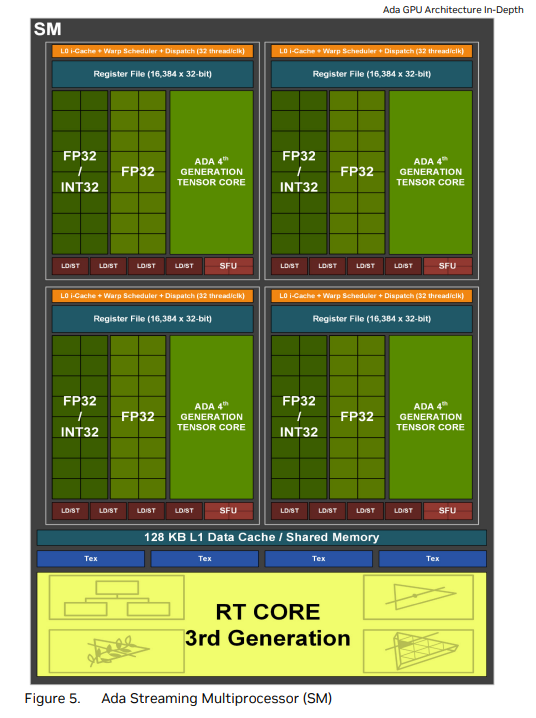
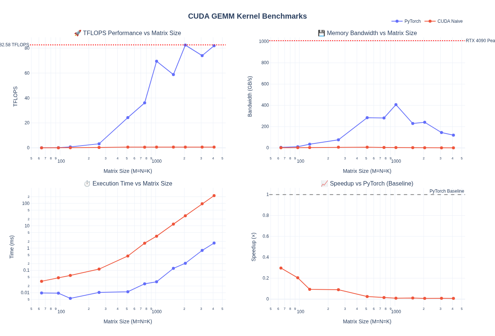
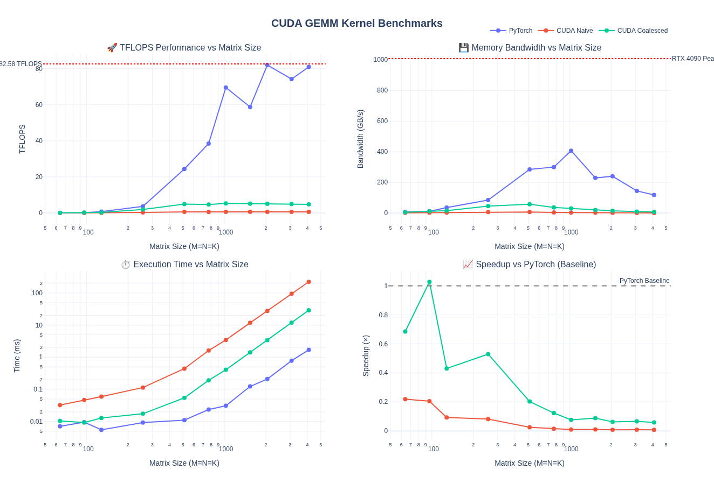
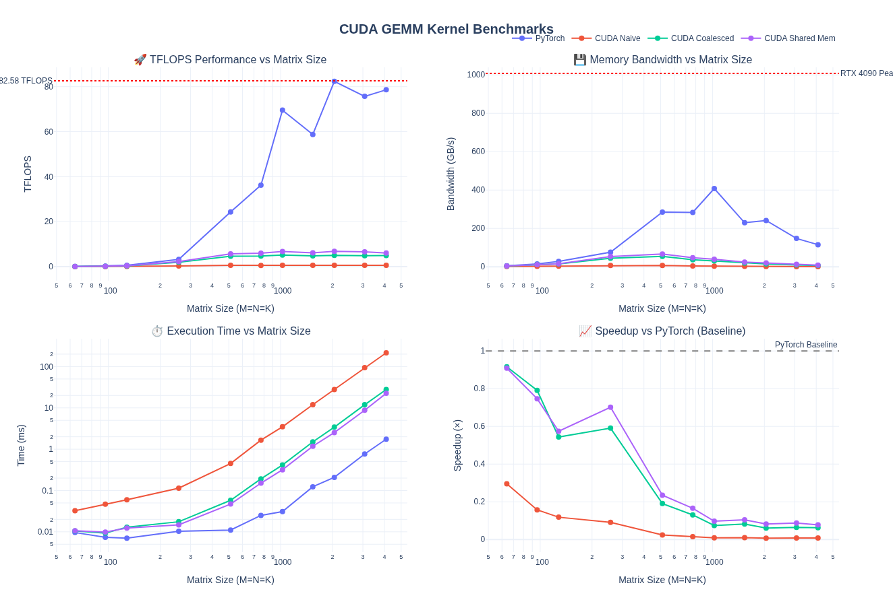
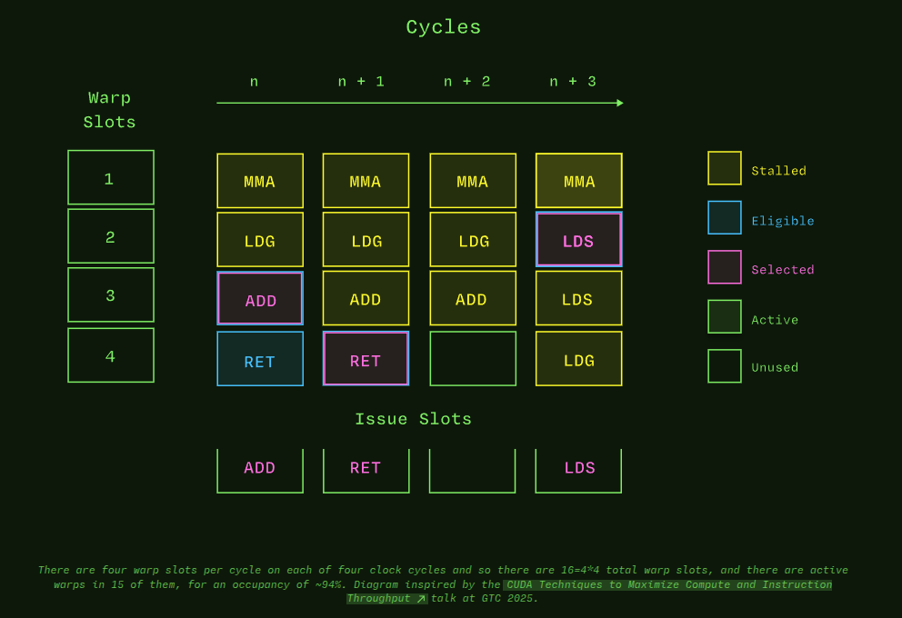
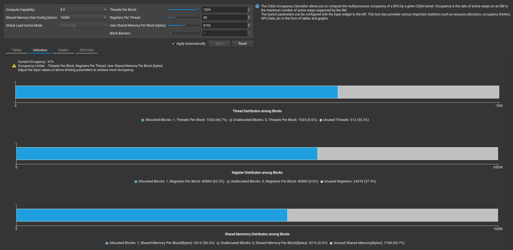
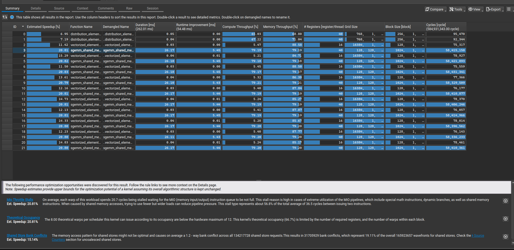
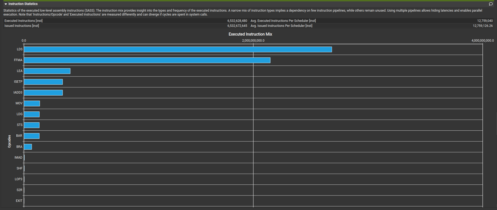

---
tags:
  - CUTLASS
  - CUDA
---

# GEMM 基础与朴素优化

> **原文**: [Learn CUTLASS the Hard Way!](https://www.kapilsharma.dev/posts/learn-cutlass-the-hard-way/) by Kapil Sharma
> **许可证**: [CC BY 4.0](https://creativecommons.org/licenses/by/4.0/) | **代码**: [gpusgobrr/explore-gemm](https://github.com/gpusgobrr/explore-gemm)
> 本文为原文的中文翻译与整理，交互式可视化部分已省略。

## 前言

作者希望深入理解 GEMM 优化的各个层面——从典型的 shared memory 缓存 kernel（如 PMPP 教材中的经典例子）到 tensor core、WMMA、swizzling、pipelining、autotuning 等现代技术。本文记录了在 RTX 4090 上从最朴素的 FP32 kernel 一路优化到 CUTLASS BF16 kernel 的完整过程。

完整实现代码：[gpusgobrr/explore-gemm](https://github.com/gpusgobrr/explore-gemm)

## GEMM 基础

GEMM（General Matrix Multiply）定义为：

$$C = \alpha AB + \beta C$$

其中：

- $A$ 为 $M \times K$ 矩阵
- $B$ 为 $K \times N$ 矩阵
- $C$ 为 $M \times N$ 矩阵（既是输入也是输出）
- $\alpha$ 和 $\beta$ 为标量系数

标准矩阵乘法 $C = AB$ 是 $\alpha = 1, \beta = 0$ 的特例。当 $\beta \neq 0$ 时，GEMM 累加到已有矩阵 $C$ 上。这种形式还支持融合操作，避免单独的 kernel 启动。

### 计算复杂度

每个元素 $C[i,j]$ 需要一次点积：

$$C[i,j] = \alpha \sum_{k=0}^{K-1} A[i,k] \times B[k,j] + \beta C[i,j]$$

对于 $M \times K$ 和 $K \times N$ 的矩阵：

- 总点积数：$M \times N$
- 每个点积的操作数：$2K$（K 次乘法 + K 次加法）+ 3 次标量操作
- **总 FLOPs**：$2MNK + MK$（点积主导）

以 $4096 \times 4096$ 矩阵乘法为例（$M = N = K = 4096$）：

- 总操作数：$2 \times 4096^3 \approx 137$ GFLOPs
- 内存需求：$3 \times 4096^2 \times 4$ bytes $\approx$ 201 MB（float32）

## 硬件规格

所有 benchmark 在 **NVIDIA GeForce RTX 4090** 上运行。

### SM 架构



| 规格 | RTX 4090 (Ada Lovelace) |
|------|------------------------|
| **架构** | Ada Lovelace |
| **CUDA Cores** | 16,384 |
| **SM 数量** | 128 |
| **FP32 性能** | 82.6 TFLOPS |
| **Tensor Cores** | 512（第 4 代） |
| **Tensor 性能（FP8）** | 660.6 TFLOPS |
| **显存** | 24 GB GDDR6X |
| **显存带宽** | 1,008 GB/s |
| **L1 Cache / Shared Memory（总计）** | 16 MB |
| **L2 Cache** | 72 MB |
| **每 SM Shared Memory** | 128 KB |
| **每 SM 寄存器** | 256 KB |

*来源: [NVIDIA Ada GPU Architecture Whitepaper](https://images.nvidia.com/aem-dam/Solutions/geforce/ada/nvidia-ada-gpu-architecture.pdf)*

可以通过 `cudaDeviceProp` 直接加载这些参数：

```cpp
for (int i = 0; i < deviceCount; ++i) {
    cudaDeviceProp prop;
    cudaGetDeviceProperties(&prop, i);

    std::cout << "Device " << i << ": " << prop.name << "\n";
    std::cout << "  Compute capability: " << prop.major << "." << prop.minor << "\n";
    std::cout << "  Total global memory: " << (prop.totalGlobalMem >> 20) << " MB\n";
    std::cout << "  Shared memory per block: " << prop.sharedMemPerBlock << " bytes\n";
    std::cout << "  Shared memory per SM: " << prop.sharedMemPerMultiprocessor << " bytes\n";
    std::cout << "  Registers per block: " << prop.regsPerBlock << "\n";
    std::cout << "  Warp size: " << prop.warpSize << "\n";
    std::cout << "  Max threads per block: " << prop.maxThreadsPerBlock << "\n";
    std::cout << "  Max threads per SM: " << prop.maxThreadsPerMultiProcessor << "\n";
    std::cout << "  Number of SMs: " << prop.multiProcessorCount << "\n";
    std::cout << "  Max blocks per SM: " << prop.maxBlocksPerMultiProcessor << "\n";
    std::cout << "  L2 Cache Size: " << prop.l2CacheSize << " bytes\n";
}
```

### Roofline 模型

[Roofline 模型](https://en.wikipedia.org/wiki/Roofline_model) 帮助我们可视化 GEMM kernel 的性能瓶颈：

1. **Compute Bound**（水平天花板）：可达到的最大 FLOPS（FP32 为 82.6 TFLOPS）
2. **Memory Bound**（斜对角线）：受内存带宽限制的性能（1,008 GB/s）

从 memory-bound 到 compute-bound 的转折点出现在算术强度约 **82 FLOP/byte** 处。现代优化的 GEMM 操作通常具有较高的算术强度，属于 compute-bound 负载。

## Naive 实现

### 概念

最简单的方法是为每个输出元素分配一个线程。每个线程独立执行：

1. 加载 $A$ 的一行（K 个元素）
2. 加载 $B$ 的一列（K 个元素）
3. 计算点积
4. 写入 $C$ 的一个元素

### Kernel

```c
template <const uint block_size>
__global__ void sgemm_naive_kernel(int num_rows_a, int num_cols_b, int num_cols_a,
                                   float alpha, const float *matrix_a,
                                   const float *matrix_b, float beta, float *output_matrix)
{
    const int output_row = blockIdx.x * block_size + (threadIdx.x % block_size);
    const int output_col = blockIdx.y * block_size + (threadIdx.x / block_size);

    if (output_row < num_rows_a && output_col < num_cols_b)
    {
        float accumulator = 0.0f;
        for (int k_idx = 0; k_idx < num_cols_a; ++k_idx)
        {
            accumulator += matrix_a[output_row * num_cols_a + k_idx] *
                           matrix_b[k_idx * num_cols_b + output_col];
        }
        const int output_idx = output_row * num_cols_b + output_col;
        output_matrix[output_idx] = alpha * accumulator + beta * output_matrix[output_idx];
    }
}
```

### Caller

直接在 torch Tensor 上调用上述 kernel：

```cpp
void sgemm_naive(const torch::Tensor &matrix_a, const torch::Tensor &matrix_b,
                 torch::Tensor &output_matrix, float alpha, float beta)
{
    const int num_rows_a = static_cast<int>(matrix_a.size(0));
    const int num_cols_a = static_cast<int>(matrix_a.size(1));
    const int num_cols_b = static_cast<int>(matrix_b.size(1));

    constexpr uint block_size = 32;
    dim3 block_dim(block_size * block_size);  // 1024 threads per block
    dim3 grid_dim(ceil_div(num_rows_a, block_size),
                  ceil_div(num_cols_b, block_size));

    sgemm_naive_kernel<block_size><<<grid_dim, block_dim>>>(
        num_rows_a, num_cols_b, num_cols_a,
        alpha, d_matrix_a, d_matrix_b, beta, d_output_matrix);
}
```

### 性能分析



对于 M = N = K = 4096：

- Naive CUDA kernel 比 PyTorch 慢 133×（0.01× 加速比）
- 仅达到 PyTorch TFLOPS 的 0.76%
- 带宽利用率差 133×（0.90 GB/s vs 119.97 GB/s）

## 全局内存合并（Global Memory Coalescing）

### 概念

要理解内存合并，先了解 GPU 执行层次：

1. **线程（Thread）**：CUDA kernel 中的单个执行单元
2. **Warp**：32 个线程一组，同时执行相同指令（SIMT — Single Instruction, Multiple Thread）
3. **Thread Block**：逻辑线程分组（最多 1024 个线程），共享资源并可同步
4. **SM（Streaming Multiprocessor）**：执行 thread block 的物理处理器

**Warp 是基本执行单元**：warp 中所有 32 个线程同时执行相同指令。当这些线程访问连续内存地址时，硬件可以将它们的内存请求合并为单个事务。现代 GPU DRAM 系统可以在一个事务中取回大块连续数据（32B、64B 或 128B cache line）。没有合并的话，32 次访问可能需要 32 个独立事务。

SM 相关要点：

- 每个 SM 有限的资源（寄存器、shared memory）
- 多个 thread block 竞争这些资源
- SM 可以在单个时钟周期内切换 warp，实现延迟隐藏——当一个 warp 等待内存时，另一个 warp 执行
- GEMM 效率取决于让所有 warp 调度器保持忙碌，且内存访问模式合并

### 为什么 Naive Kernel 慢？

添加调试信息查看线程映射：

```text
Thread 0 ; Warp 0: Multiplying A[0][0] * B[0][0] = C[0][0]
Thread 1 ; Warp 0: Multiplying A[1][0] * B[0][0] = C[1][0]
...
Thread 31 ; Warp 0: Multiplying A[31][0] * B[0][0] = C[31][0]
Thread 32 ; Warp 1: Multiplying A[0][0] * B[0][1] = C[0][1]
Thread 33 ; Warp 1: Multiplying A[1][0] * B[0][1] = C[1][1]
```

可以看到 naive kernel 的内存访问模式是低效的。warp 中的每个线程访问 `A[k][0]`，其中 k 是 warp 内的线程 ID。线程访问分散的内存位置，每次访问需要独立的内存事务。

**问题**：线程以分散、非合并的模式访问内存。

解决方案只需交换行列计算中的 `%` 和 `/`：

```c
// 关键改变：交换 % 和 / 以实现内存合并
const int output_row = blockIdx.x * block_size + (threadIdx.x / block_size);
const int output_col = blockIdx.y * block_size + (threadIdx.x % block_size);
```

### Kernel

```c
template <const uint block_size>
__global__ void sgemm_global_mem_coalesce_kernel(int num_rows_a, int num_cols_b, int num_cols_a,
                                                 float alpha, const float *matrix_a,
                                                 const float *matrix_b, float beta, float *matrix_c)
{
    // 关键改变：交换 % 和 / 以实现合并访问
    const int output_row = blockIdx.x * block_size + (threadIdx.x / block_size);
    const int output_col = blockIdx.y * block_size + (threadIdx.x % block_size);

    if (output_row < num_rows_a && output_col < num_cols_b)
    {
        float accumulator = 0.0f;
        for (int k_idx = 0; k_idx < num_cols_a; ++k_idx)
        {
            accumulator += matrix_a[output_row * num_cols_a + k_idx] *
                          matrix_b[k_idx * num_cols_b + output_col];
        }
        const int output_idx = output_row * num_cols_b + output_col;
        matrix_c[output_idx] = alpha * accumulator + beta * matrix_c[output_idx];
    }
}
```

关键改变：连续 `threadIdx.x` 的线程现在访问 A 同一行中的连续元素，实现了合并访问。

### 性能分析



对于 M = N = K = 4096：

- **吞吐量**：7.63× TFLOPS 提升（0.62 → 4.73 TFLOPS），仍仅为 PyTorch 的 5.8%
- **带宽**：7.71× 带宽提升（0.90 → 6.94 GB/s）

性能有所提升，但仍远落后于 PyTorch。

## Shared Memory 缓存

### 概念

即使有了合并访问，naive 和 coalesced kernel 仍反复从全局内存读取相同数据：

- 矩阵 $A$ 的每个元素被读取 $N$ 次（$B$ 的每一列各一次）
- 矩阵 $B$ 的每个元素被读取 $M$ 次（$A$ 的每一行各一次）

RTX 4090 每个 SM 有 **128 KB shared memory**（16 MB / 128 SMs），作为片上快速 cache。Shared memory 在 thread block 之间分配，block 内所有线程可访问。

优化策略：将矩阵 A 和 B 的 tile（分块）加载到快速 shared memory 中，利用缓存 tile 数据计算部分结果（多线程高复用），然后沿矩阵滑动 tile 计算最终结果——将 bandwidth-bound 问题转化为 compute-bound 问题。

注意：需要在两处同步线程——加载数据到 shared memory 之后，以及完成 tiled matmul 之后：

- 确保所有数据加载完毕后再做乘法计算
- 确保所有计算数据写回矩阵 C 后再处理下一组 tile

### Kernel

```c
template <const uint block_size>
__global__ void sgemm_shared_mem_kernel(int num_rows_a, int num_cols_b, int num_cols_a,
                                        float alpha, const float *matrix_a,
                                        const float *matrix_b, float beta, float *matrix_c)
{
    const uint block_row = blockIdx.x;
    const uint block_col = blockIdx.y;

    __shared__ float tile_a[block_size * block_size];
    __shared__ float tile_b[block_size * block_size];

    const uint thread_row = threadIdx.x / block_size;
    const uint thread_col = threadIdx.x % block_size;

    const uint global_row = block_row * block_size + thread_row;
    const uint global_col = block_col * block_size + thread_col;

    matrix_a += block_row * block_size * num_cols_a;
    matrix_b += block_col * block_size;
    matrix_c += block_row * block_size * num_cols_b + block_col * block_size;

    float accumulator = 0.0f;

    for (int tile_idx = 0; tile_idx < num_cols_a; tile_idx += block_size)
    {
        if (global_row < num_rows_a && (tile_idx + thread_col) < num_cols_a)
            tile_a[thread_row * block_size + thread_col] =
                matrix_a[thread_row * num_cols_a + thread_col];
        else
            tile_a[thread_row * block_size + thread_col] = 0.0f;

        if ((tile_idx + thread_row) < num_cols_a && global_col < num_cols_b)
            tile_b[thread_row * block_size + thread_col] =
                matrix_b[thread_row * num_cols_b + thread_col];
        else
            tile_b[thread_row * block_size + thread_col] = 0.0f;

        __syncthreads();

        matrix_a += block_size;
        matrix_b += block_size * num_cols_b;

        for (int dot_idx = 0; dot_idx < block_size; ++dot_idx)
        {
            accumulator += tile_a[thread_row * block_size + dot_idx] *
                           tile_b[dot_idx * block_size + thread_col];
        }

        __syncthreads();
    }

    if (global_row < num_rows_a && global_col < num_cols_b)
    {
        matrix_c[thread_row * num_cols_b + thread_col] =
            alpha * accumulator + beta * matrix_c[thread_row * num_cols_b + thread_col];
    }
}
```

### 性能分析



对于 M = N = K = 4096：

- **1.24× TFLOPS 提升**（4.94 → 6.10 TFLOPS）
- **1.24× 带宽提升**（7.23 → 8.94 GB/s）
- **比 naive 快 9.5×**（0.64 → 6.10 TFLOPS）
- 仍仅为 **PyTorch 的 7.8%**

Shared memory 缓存相比纯 coalescing 仅带来约 24% 的提升，说明还没有有效隐藏内存延迟。

## 理解 GPU Occupancy

在进入更高级优化之前，需要理解 **occupancy**——它决定了 GPU 资源的利用率。

### 什么是 Occupancy？

**Occupancy** 是每个 SM 上活跃 warp 与最大可能 warp 的比值：

$$\text{Occupancy} = \frac{\text{Active Warps per SM}}{\text{Maximum Warps per SM}}$$



GPU 通过大规模并行隐藏内存延迟。当一个 warp 等待内存时，SM 立即切换执行另一个 warp。Occupancy 不直接提升性能，而是通过延迟隐藏间接提升。更高的 occupancy 意味着更多可用于计算的 warp，能更有效地隐藏延迟。如果 occupancy 低，硬件会闲置等待数据。

但 **occupancy 不是一切**。100% occupancy 但内存访问模式差的 kernel 仍可能性能差，因为可能导致每个线程的寄存器/shared memory 更少。

### 关键考量

每个线程从 SM 的寄存器文件获取寄存器。每线程更多寄存器意味着更少的并发线程：

$$\text{Max Threads} = \min\left(\frac{65536 \text{ registers/SM}}{\text{registers per thread}}, 1536\right)$$

| Registers/Thread | Max Threads | Active Warps | Occupancy |
|-----------------|------------|-------------|-----------|
| 32 | 1,536（硬件上限） | 48 | 100% |
| 64 | 1,024 | 32 | 66.7% |
| 128 | 512 | 16 | 33.3% |

Shared memory 在同一 SM 上的 thread block 之间分配：

$$\text{Max Blocks} = \min\left(\frac{102400 \text{ bytes/SM}}{\text{shared memory per block}}, 32\right)$$

| Shared Memory/Block | Max Blocks | 备注 |
|---------------------|-----------|------|
| 0 KB | 32 | 无 shared memory 使用 |
| 24 KB | 4 | 适合中等 tiling |
| 48 KB | 2 | 大 tile，更少 block |

每 block 的线程数也影响每 SM 能容纳多少 block：

| Threads/Block | Warps/Block | Max Blocks/SM | Active Warps | Occupancy |
|--------------|------------|--------------|-------------|-----------|
| 128 | 4 | 12 | 48 | 100% |
| 256 | 8 | 6 | 48 | 100% |
| 512 | 16 | 3 | 48 | 100% |
| 1024 | 32 | 1 | 32 | 66.7% |

### 我们 Shared Memory Kernel 的 Occupancy

分析当前 kernel：

```c
constexpr uint BLOCKSIZE = 32;
dim3 block_dim(BLOCKSIZE * BLOCKSIZE);  // 1024 threads per block

__shared__ float tile_a[32 * 32];  // 4 KB
__shared__ float tile_b[32 * 32];  // 4 KB
// 总计: 8 KB per block
```

Occupancy 计算：

1. **每 block 线程数**：1,024 threads（32 warps）
2. **每 SM block 数（线程限制）**：$\lfloor 1536 / 1024 \rfloor = 1$ block
3. **每 SM block 数（shared memory 限制）**：$\lfloor 102400 / 8192 \rfloor = 12$ blocks
4. **每 SM block 数（硬件限制）**：32 blocks
5. **实际每 SM block 数**：$\min(1, 12, 32) = 1$ block

Active warps：$1 \times 32 = 32$ warps

**Occupancy**：$32 / 48 = 66.7\%$

**问题**：大 block size（1,024 线程）限制每 SM 仅 1 个 block，导致仅 66.7% occupancy。

### Nsight Compute Profiling

确认 occupancy 计算：



NCU Summary 提供了 kernel 仍然慢的原因：



查看指令混合，可以看到 **LDS（shared memory 内加载）主导了指令混合**，这不好：



下一步将专注于减少 kernel 中的 LDS 指令。
