---
tags:
  - CUTLASS
  - CUDA
---

# SIMT 分块优化

> **原文**: [Learn CUTLASS the Hard Way!](https://www.kapilsharma.dev/posts/learn-cutlass-the-hard-way/) by Kapil Sharma
> **许可证**: [CC BY 4.0](https://creativecommons.org/licenses/by/4.0/) | **代码**: [gpusgobrr/explore-gemm](https://github.com/gpusgobrr/explore-gemm)
> 本文为原文的中文翻译与整理，交互式可视化部分已省略。

本文在 [上一篇](01_gemm_basics_and_naive.md) 的基础上，通过 1D/2D 分块、向量化访存、warp tiling 等 SIMT 级优化手段，将 GEMM 性能从 PyTorch 的 ~8% 提升至 ~54%。

## 1D Block Tiling

### 概念

在之前的 kernel 中，每个线程计算 C 的一个输出元素，导致每个线程需要反复从 shared memory 加载数据，内存访问主导了执行时间。

改进思路：每个线程计算沿一个维度的多个输出元素。为此，需要从 SMEM 预取数据到寄存器（提高复用），减少重复 SMEM 加载。

本质上是提升 kernel 的**算术强度**——用相同的加载数据计算更多结果，即提高 FLOPS/byte。

引入 TM 个累加器，每个线程计算 TM 个输出：

```c
float thread_results[TM] = {0.0f};
```

计算过程：

```c
for (uint dot_idx = 0; dot_idx < BK; ++dot_idx) {
    float b_tmp = tile_b[dot_idx * BN + thread_col];
    for (uint res_idx = 0; res_idx < TM; ++res_idx) {
        thread_results[res_idx] +=
            tile_a[(thread_row * TM + res_idx) * BK + dot_idx] * b_tmp;
    }
}
```

### Kernel

引入可配置参数 BM、BN、BK（block 在 M、N、K 维度的大小）和 TM（每线程计算值数）：

```c
template <const int BM, const int BN, const int BK, const int TM>
__global__ void sgemm_blocktiling_1d_kernel(int num_rows_a, int num_cols_b, int num_cols_a,
                                            float alpha, const float *matrix_a,
                                            const float *matrix_b, float beta,
                                            float *matrix_c)
{
    const uint block_row = blockIdx.x;
    const uint block_col = blockIdx.y;

    __shared__ float tile_a[BM * BK];
    __shared__ float tile_b[BK * BN];

    const uint thread_row = threadIdx.x / BN;
    const uint thread_col = threadIdx.x % BN;

    const int global_row = block_row * BM + thread_row * TM;
    const int global_col = block_col * BN + thread_col;

    matrix_a += block_row * BM * num_cols_a;
    matrix_b += block_col * BN;
    matrix_c += block_row * BM * num_cols_b + block_col * BN;

    float thread_results[TM] = {0.0f};

    for (int tile_idx = 0; tile_idx < num_cols_a; tile_idx += BK)
    {
        const uint a_row = threadIdx.x / BK;
        const uint a_col = threadIdx.x % BK;
        if ((block_row * BM + a_row) < num_rows_a && (tile_idx + a_col) < num_cols_a)
            tile_a[a_row * BK + a_col] = matrix_a[a_row * num_cols_a + a_col];
        else
            tile_a[a_row * BK + a_col] = 0.0f;

        const uint b_row = threadIdx.x / BN;
        const uint b_col = threadIdx.x % BN;
        if ((tile_idx + b_row) < num_cols_a && (block_col * BN + b_col) < num_cols_b)
            tile_b[b_row * BN + b_col] = matrix_b[b_row * num_cols_b + b_col];
        else
            tile_b[b_row * BN + b_col] = 0.0f;

        __syncthreads();

        matrix_a += BK;
        matrix_b += BK * num_cols_b;

        for (uint dot_idx = 0; dot_idx < BK; ++dot_idx) {
            float b_tmp = tile_b[dot_idx * BN + thread_col];
            for (uint res_idx = 0; res_idx < TM; ++res_idx) {
                thread_results[res_idx] +=
                    tile_a[(thread_row * TM + res_idx) * BK + dot_idx] * b_tmp;
            }
        }

        __syncthreads();
    }

    for (uint res_idx = 0; res_idx < TM; ++res_idx) {
        int row = global_row + res_idx;
        if (row < num_rows_a && global_col < num_cols_b) {
            matrix_c[(thread_row * TM + res_idx) * num_cols_b + thread_col] =
                alpha * thread_results[res_idx] +
                beta * matrix_c[(thread_row * TM + res_idx) * num_cols_b + thread_col];
        }
    }
}
```

### Caller

```c
void sgemm_blocktiling_1d(const torch::Tensor &matrix_a, const torch::Tensor &matrix_b,
                          torch::Tensor &output_matrix, float alpha, float beta)
{
    constexpr int BM = 64;
    constexpr int BN = 64;
    constexpr int BK = 8;
    constexpr int TM = 8;

    // 线程数 = (BM / TM) * BN = (64 / 8) * 64 = 512
    dim3 block_dim((BM / TM) * BN);
    dim3 grid_dim(CEIL_DIV(num_rows_a, BM),
                  CEIL_DIV(num_cols_b, BN));

    sgemm_blocktiling_1d_kernel<BM, BN, BK, TM><<<grid_dim, block_dim>>>(...);
}
```

### 性能分析

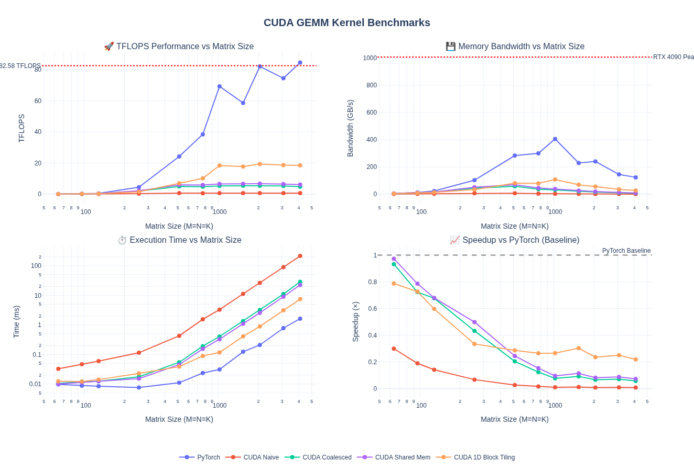

对于 M = N = K = 4096：

- **3.03× TFLOPS 提升**（6.10 → 18.49 TFLOPS）
- **比 naive 快 28.9×**
- 达到 **PyTorch 的 21.8%**

关键洞察：寄存器级 tiling 通过提升算术强度带来 3× 提升。将 `b_tmp` 缓存到寄存器中复用 TM 次，减少了 shared memory 流量。

| Kernel | Time (ms) | TFLOPS | 相对 PyTorch |
|--------|-----------|--------|-------------|
| Naive | 214.24 | 0.64 | 0.8% |
| Coalesced | 28.62 | 4.80 | 5.7% |
| Shared Memory | 22.52 | 6.10 | 7.2% |
| **1D Block Tiling** | **7.43** | **18.49** | **21.8%** |
| PyTorch | 1.62 | 84.62 | 100% |

### NCU Profiling

NCU 确认了改进：

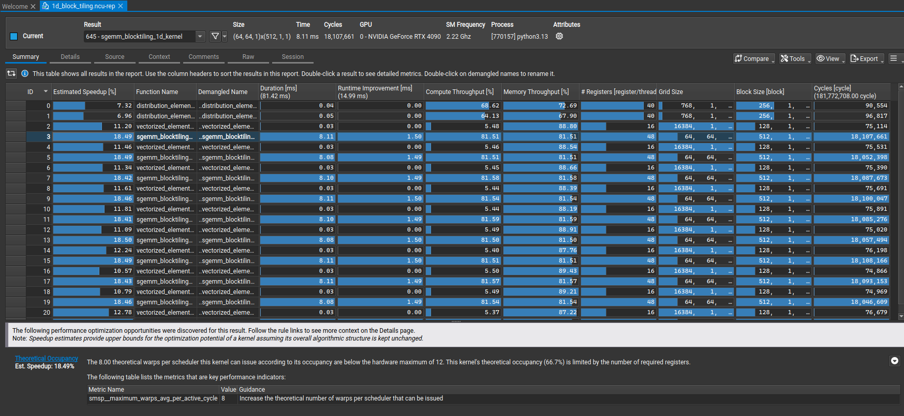

MIO Throttle Stalls 和 Shared Store Bank Conflicts 的警告消失了。

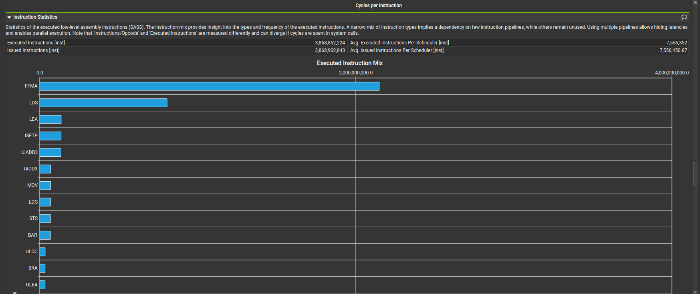

LDS 不再是指令混合的主导。

Memory chart 对比（左：shared memory kernel，右：1D block tiling kernel）：

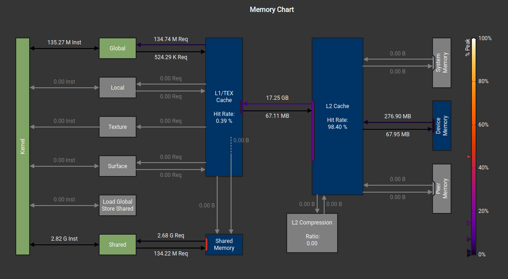

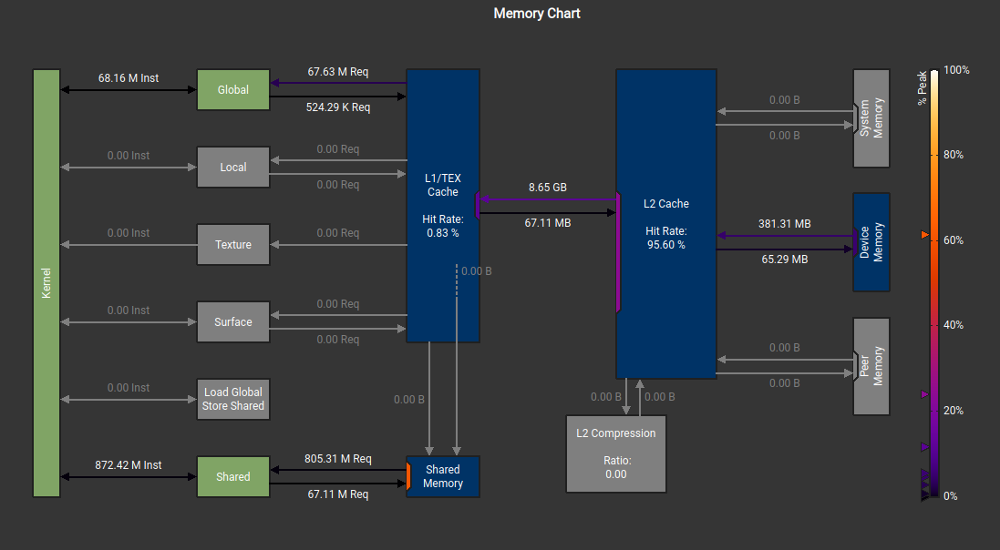

关键要点：每线程计算更多值时，每个结果的 load/store 减少，即算术强度提升。

## 2D Block Tiling

### 概念

2D tiling 是 1D 的自然扩展——每个线程计算 TM × TN 个输出（如 8 × 8 = 64 个），而非仅 TM 个。虽然需要更多寄存器，但通过更充分复用 shared memory 进一步提升算术强度。

这创建了**双向寄存器复用**：

- A 的每个值（加载到 `register_m[TM]`）在 TN 次计算中复用
- B 的每个值（加载到 `register_n[TN]`）在 TM 次计算中复用
- 形成寄存器级的**外积**模式

代码实现了两个 kernel：**主 kernel**（无边界检查）处理所有内部 block，**边缘 kernel**（有边界检查）处理边界 block。

### Kernel

```c
template <const int BM, const int BN, const int BK, const int TM, const int TN>
__global__ void sgemm_blocktiling_2d_kernel(int num_rows_a, int num_cols_b, int num_cols_a,
                                            float alpha, const float *matrix_a,
                                            const float *matrix_b, float beta,
                                            float *matrix_c)
{
    const uint block_row = blockIdx.x;
    const uint block_col = blockIdx.y;

    __shared__ float tile_a[BM * BK];
    __shared__ float tile_b[BK * BN];

    const uint thread_row = threadIdx.x / (BN / TN);
    const uint thread_col = threadIdx.x % (BN / TN);
    const uint num_threads = (BM / TM) * (BN / TN);

    matrix_a += block_row * BM * num_cols_a;
    matrix_b += block_col * BN;
    matrix_c += block_row * BM * num_cols_b + block_col * BN;

    float thread_results[TM * TN] = {0.0f};
    float register_m[TM] = {0.0f};
    float register_n[TN] = {0.0f};

    for (uint block_k_idx = 0; block_k_idx < num_cols_a; block_k_idx += BK)
    {
#pragma unroll
        for (uint load_offset = 0; load_offset < BM * BK; load_offset += num_threads)
        {
            uint load_idx = threadIdx.x + load_offset;
            uint a_row = load_idx / BK;
            uint a_col = load_idx % BK;
            tile_a[load_idx] = matrix_a[a_row * num_cols_a + a_col];
        }

#pragma unroll
        for (uint load_offset = 0; load_offset < BK * BN; load_offset += num_threads)
        {
            uint load_idx = threadIdx.x + load_offset;
            uint b_row = load_idx / BN;
            uint b_col = load_idx % BN;
            tile_b[load_idx] = matrix_b[b_row * num_cols_b + b_col];
        }

        __syncthreads();

        matrix_a += BK;
        matrix_b += BK * num_cols_b;

        for (uint dot_idx = 0; dot_idx < BK; ++dot_idx)
        {
            for (uint i = 0; i < TM; ++i)
                register_m[i] = tile_a[(thread_row * TM + i) * BK + dot_idx];

            for (uint i = 0; i < TN; ++i)
                register_n[i] = tile_b[dot_idx * BN + thread_col * TN + i];

            for (uint res_idx_m = 0; res_idx_m < TM; ++res_idx_m)
                for (uint res_idx_n = 0; res_idx_n < TN; ++res_idx_n)
                    thread_results[res_idx_m * TN + res_idx_n] +=
                        register_m[res_idx_m] * register_n[res_idx_n];
        }

        __syncthreads();
    }

#pragma unroll
    for (uint res_idx_m = 0; res_idx_m < TM; ++res_idx_m)
    {
#pragma unroll
        for (uint res_idx_n = 0; res_idx_n < TN; ++res_idx_n)
        {
            const uint c_idx = (thread_row * TM + res_idx_m) * num_cols_b +
                               (thread_col * TN + res_idx_n);
            matrix_c[c_idx] = alpha * thread_results[res_idx_m * TN + res_idx_n] +
                              beta * matrix_c[c_idx];
        }
    }
}
```

代码中使用了 `#pragma unroll` 指令——编译器优化技术，将小循环展开为顺序指令，消除循环控制开销。

### Caller

```c
constexpr int BM = 64;
constexpr int BN = 64;
constexpr int BK = 8;
constexpr int TM = 8;
constexpr int TN = 8;

// 线程数 = (64 / 8) * (64 / 8) = 64
dim3 block_dim((BM / TM) * (BN / TN));
```

### 性能分析

对于 4096×4096：

- **1.66× TFLOPS 提升**（18.40 → 30.55 TFLOPS）
- **PyTorch 的 38.7%**
- **比 naive 快 46.9×**

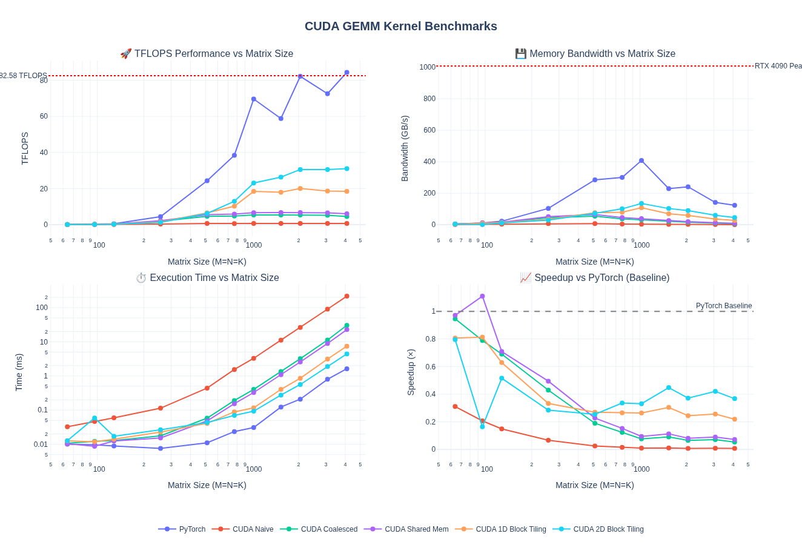

| Kernel | Time (ms) | TFLOPS | 相对 PyTorch |
|--------|-----------|--------|-------------|
| Naive | 210.75 | 0.65 | 0.8% |
| Coalesced | 26.96 | 5.10 | 6.5% |
| Shared Memory | 22.67 | 6.06 | 7.7% |
| 1D Block Tiling | 7.47 | 18.40 | 23.3% |
| **2D Block Tiling** | **4.50** | **30.55** | **38.7%** |
| PyTorch | 1.74 | 79.00 | 100% |

NCU 分析指出下一步优化方向：

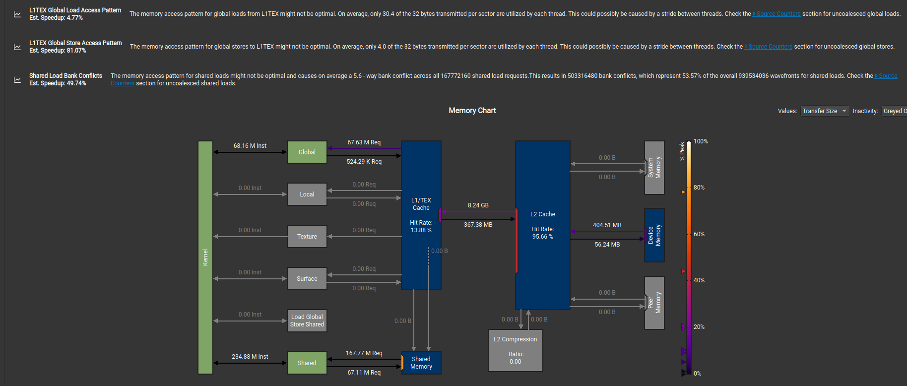

- L1TEX 全局存储访问模式不佳（每 sector 32 bytes 中平均只用 4.0 bytes）
- Shared load bank conflict 平均 5.6 路
- 非合并 shared 访问导致 37% 过多 wavefront

## Vectorized Memory Access

### 概念

GEMM 瓶颈在内存传输速度。使用**向量化内存操作**可提升有效带宽利用率。

CUDA 提供内建向量类型（`float2`、`float4`、`int2`、`int4`），支持单条指令加载/存储多个值。`float4` 一次取 **128 bits（16 bytes）**，而非四次独立的 32 位加载。

| 加载类型 | 大小 | 指令 | 元素数 | 4 元素所需指令数 |
|---------|------|------|-------|---------------|
| `float` | 32 bits | `LDG.E` | 1 | 4 |
| `float2` | 64 bits | `LDG.E.64` | 2 | 2 |
| `float4` | 128 bits | `LDG.E.128` | 4 | 1 |

当前 2D tiling kernel 中每线程从 shared memory 加载到寄存器是标量操作。如果 TM=8，需要 8 次独立加载。向量化后可合并为 2 次 `float4` 加载：

```c
// 标量方式: 8 次 float 加载
for (uint i = 0; i < TM; ++i) {
    register_m[i] = tile_a[(thread_row * TM + i) * BK + dot_idx];
}

// 向量化方式: 2 次 float4 加载
*reinterpret_cast<float4*>(&register_m[0]) =
    *reinterpret_cast<const float4*>(&tile_a[(thread_row * TM) * BK + dot_idx]);
*reinterpret_cast<float4*>(&register_m[4]) =
    *reinterpret_cast<const float4*>(&tile_a[(thread_row * TM + 4) * BK + dot_idx]);
```

权衡：向量化 `float4` 加载减少内存事务，但增加寄存器压力（可能降低 occupancy），需要处理非对齐尾部。

### Kernel

```c
template <const int BM, const int BN, const int BK, const int TM, const int TN>
__global__ void sgemm_vectorize_kernel(int num_rows_a, int num_cols_b, int num_cols_a,
                                       float alpha, const float *matrix_a,
                                       const float *matrix_b, float beta,
                                       float *matrix_c)
{
    const uint block_row = blockIdx.y;
    const uint block_col = blockIdx.x;

    const uint thread_col = threadIdx.x % (BN / TN);
    const uint thread_row = threadIdx.x / (BN / TN);

    __shared__ float tile_a[BM * BK];
    __shared__ float tile_b[BK * BN];

    matrix_a += block_row * BM * num_cols_a;
    matrix_b += block_col * BN;
    matrix_c += block_row * BM * num_cols_b + block_col * BN;

    '''
    向量化加载索引计算
    每次加载 4 个 float（float4）
    '''
    const uint inner_row_a = threadIdx.x / (BK / 4);
    const uint inner_col_a = threadIdx.x % (BK / 4);
    const uint inner_row_b = threadIdx.x / (BN / 4);
    const uint inner_col_b = threadIdx.x % (BN / 4);

    float thread_results[TM * TN] = {0.0f};
    float register_m[TM] = {0.0f};
    float register_n[TN] = {0.0f};

    for (uint block_k_idx = 0; block_k_idx < num_cols_a; block_k_idx += BK) {

        '''
        float4 向量化加载 tile_a，转置存储：tile_a[col][row]
        转置目的：后续从 SMEM 加载到寄存器时实现合并访问
        '''
        float4 tmp_a = reinterpret_cast<const float4*>(
            &matrix_a[inner_row_a * num_cols_a + inner_col_a * 4])[0];
        tile_a[(inner_col_a * 4 + 0) * BM + inner_row_a] = tmp_a.x;
        tile_a[(inner_col_a * 4 + 1) * BM + inner_row_a] = tmp_a.y;
        tile_a[(inner_col_a * 4 + 2) * BM + inner_row_a] = tmp_a.z;
        tile_a[(inner_col_a * 4 + 3) * BM + inner_row_a] = tmp_a.w;

        '''
        float4 向量化加载 tile_b，行主序存储
        '''
        float4 tmp_b = reinterpret_cast<const float4*>(
            &matrix_b[inner_row_b * num_cols_b + inner_col_b * 4])[0];
        tile_b[inner_row_b * BN + inner_col_b * 4 + 0] = tmp_b.x;
        tile_b[inner_row_b * BN + inner_col_b * 4 + 1] = tmp_b.y;
        tile_b[inner_row_b * BN + inner_col_b * 4 + 2] = tmp_b.z;
        tile_b[inner_row_b * BN + inner_col_b * 4 + 3] = tmp_b.w;

        __syncthreads();

        matrix_a += BK;
        matrix_b += BK * num_cols_b;

        for (uint dot_idx = 0; dot_idx < BK; ++dot_idx) {
            #pragma unroll
            for (uint i = 0; i < TM; ++i)
                register_m[i] = tile_a[dot_idx * BM + thread_row * TM + i];  // 转置后的布局

            #pragma unroll
            for (uint i = 0; i < TN; ++i)
                register_n[i] = tile_b[dot_idx * BN + thread_col * TN + i];

            #pragma unroll
            for (uint res_idx_m = 0; res_idx_m < TM; ++res_idx_m)
                #pragma unroll
                for (uint res_idx_n = 0; res_idx_n < TN; ++res_idx_n)
                    thread_results[res_idx_m * TN + res_idx_n] +=
                        register_m[res_idx_m] * register_n[res_idx_n];
        }

        __syncthreads();
    }

    #pragma unroll
    for (uint res_idx_m = 0; res_idx_m < TM; ++res_idx_m) {
        #pragma unroll
        for (uint res_idx_n = 0; res_idx_n < TN; ++res_idx_n) {
            const uint c_idx = (thread_row * TM + res_idx_m) * num_cols_b +
                               (thread_col * TN + res_idx_n);
            matrix_c[c_idx] = alpha * thread_results[res_idx_m * TN + res_idx_n] +
                              beta * matrix_c[c_idx];
        }
    }
}
```

### 性能分析

向量化 kernel 在大矩阵上有显著提升，但小到中矩阵性能有所下降。

对于 4096×4096：

- **1.27× TFLOPS 提升**（30.85 → 39.00 TFLOPS）
- **PyTorch 的 46.3%**
- **比 naive 快 59.7×**

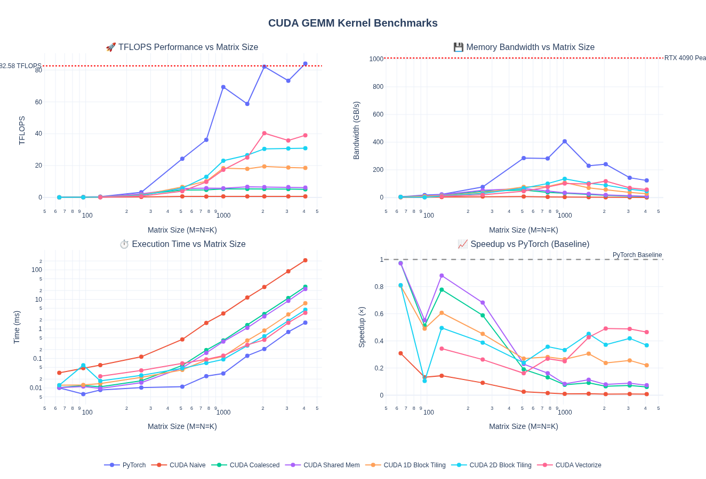

| Kernel | Time (ms) | TFLOPS | 相对 PyTorch |
|--------|-----------|--------|-------------|
| 2D Block Tiling | 4.46 | 30.85 | 36.6% |
| **Vectorized** | **3.52** | **39.00** | **46.3%** |
| PyTorch | 1.63 | 84.23 | 100% |

## Warp Tiling

### 概念

优化了线程级和 block 级 tiling 之后，下一步是 **warp 级 tiling**——利用 32 线程 warp 执行单元实现更好的寄存器复用和计算效率。

我们在逐步接近 CUTLASS 的领地。CUTLASS 库实现了映射 GPU 内存层次的多层 tiling 策略：

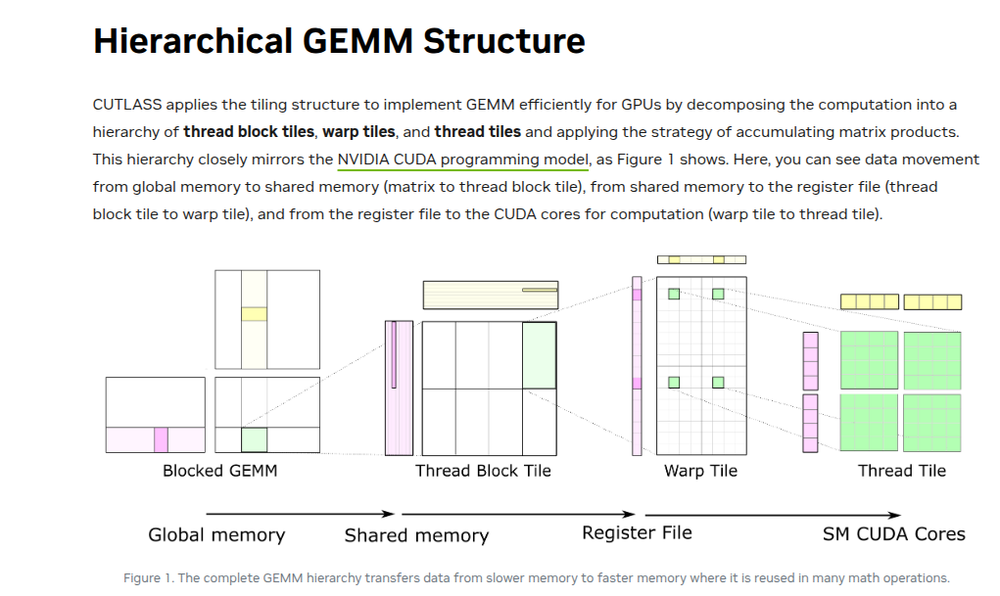

*来源: [NVIDIA CUTLASS Blog](https://developer.nvidia.com/blog/cutlass-linear-algebra-cuda/)*

Warp tiling 在数据从 shared memory 加载到寄存器时增加了一层——warp tile 级别的加载。每个 warp 内的线程计算自己的小部分。

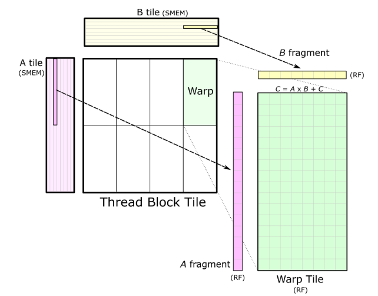

Thread tile（下一层 tiling）实际上就是之前讨论的 2D Tiling：

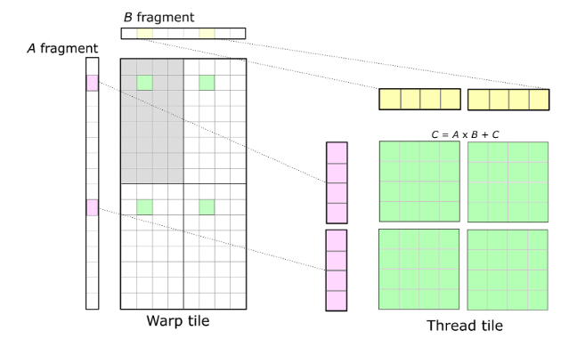

伪代码：

```text
for (k = 0; k < K; k += BK) {
    // 1. 加载 A_tile[BM x BK] 和 B_tile[BK x BN] 到 shared memory
    __syncthreads();

    // 2. 每个 warp 从 shared memory 加载自己的子 tile 到寄存器
    for (int kk = 0; kk < BK; ++kk) {
        // 3. 每个线程在寄存器中计算自己的 tile
        C_reg[m][n] += A_frag[m][kk] * B_frag[kk][n];
    }

    __syncthreads();
}

// 4. 将每个线程的 C_reg 结果写回全局内存
```

### Kernel

层次结构：Block (BM × BN) → Warps (WM × WN) → Warp Subtiles (WSUBM × WSUBN) → Thread Tiles (TM × TN)

```c
constexpr int WARPSIZE = 32;

'''
从全局内存向量化加载到 shared memory
tile_a 转置存储以利于后续 SMEM 访问合并
'''
template <const int BM, const int BN, const int BK, const int row_stride_a, const int row_stride_b>
__device__ void load_from_gmem(int num_cols_b, int num_cols_a,
                               const float *matrix_a, const float *matrix_b,
                               float *tile_a, float *tile_b,
                               int inner_row_a, int inner_col_a,
                               int inner_row_b, int inner_col_b)
{
    for (uint offset = 0; offset + row_stride_a <= BM; offset += row_stride_a)
    {
        const float4 tmp_a = reinterpret_cast<const float4 *>(
            &matrix_a[(inner_row_a + offset) * num_cols_a + inner_col_a * 4])[0];
        tile_a[(inner_col_a * 4 + 0) * BM + inner_row_a + offset] = tmp_a.x;
        tile_a[(inner_col_a * 4 + 1) * BM + inner_row_a + offset] = tmp_a.y;
        tile_a[(inner_col_a * 4 + 2) * BM + inner_row_a + offset] = tmp_a.z;
        tile_a[(inner_col_a * 4 + 3) * BM + inner_row_a + offset] = tmp_a.w;
    }

    for (uint offset = 0; offset + row_stride_b <= BK; offset += row_stride_b)
    {
        reinterpret_cast<float4 *>(
            &tile_b[(inner_row_b + offset) * BN + inner_col_b * 4])[0] =
            reinterpret_cast<const float4 *>(
                &matrix_b[(inner_row_b + offset) * num_cols_b + inner_col_b * 4])[0];
    }
}

'''
Warp tile 级计算
每个 warp 处理 WM × WN 子矩阵
内部拆分为 WMITER × WNITER 个 sub-tile
每个 sub-tile 大小 WSUBM × WSUBN，由 thread tile TM × TN 组成
'''
template <const int BM, const int BN, const int BK, const int WM, const int WN,
          const int WMITER, const int WNITER, const int WSUBM, const int WSUBN,
          const int TM, const int TN>
__device__ void process_warp_tile(float *register_m, float *register_n, float *thread_results,
                                  const float *tile_a, const float *tile_b,
                                  const uint warp_row, const uint warp_col,
                                  const uint thread_row_in_warp, const uint thread_col_in_warp)
{
    for (uint dot_idx = 0; dot_idx < BK; ++dot_idx)
    {
        for (uint wsub_row_idx = 0; wsub_row_idx < WMITER; ++wsub_row_idx)
            for (uint i = 0; i < TM; ++i)
                register_m[wsub_row_idx * TM + i] =
                    tile_a[(dot_idx * BM) + warp_row * WM + wsub_row_idx * WSUBM +
                           thread_row_in_warp * TM + i];

        for (uint wsub_col_idx = 0; wsub_col_idx < WNITER; ++wsub_col_idx)
            for (uint i = 0; i < TN; ++i)
                register_n[wsub_col_idx * TN + i] =
                    tile_b[(dot_idx * BN) + warp_col * WN + wsub_col_idx * WSUBN +
                           thread_col_in_warp * TN + i];

        for (uint wsub_row_idx = 0; wsub_row_idx < WMITER; ++wsub_row_idx)
            for (uint wsub_col_idx = 0; wsub_col_idx < WNITER; ++wsub_col_idx)
                for (uint res_idx_m = 0; res_idx_m < TM; ++res_idx_m)
                    for (uint res_idx_n = 0; res_idx_n < TN; ++res_idx_n)
                        thread_results[(wsub_row_idx * TM + res_idx_m) * (WNITER * TN) +
                                       (wsub_col_idx * TN) + res_idx_n] +=
                            register_m[wsub_row_idx * TM + res_idx_m] *
                            register_n[wsub_col_idx * TN + res_idx_n];
    }
}

'''
主 kernel：组合全局加载 + warp tile 计算 + 结果写回
使用 __launch_bounds__ 控制 occupancy
'''
template <const int BM, const int BN, const int BK, const int WM, const int WN,
          const int WNITER, const int TM, const int TN, const int NUM_THREADS>
__global__ void __launch_bounds__(NUM_THREADS)
    sgemm_warptiling_kernel(int num_rows_a, int num_cols_b, int num_cols_a,
                            float alpha, const float *matrix_a, const float *matrix_b,
                            float beta, float *matrix_c)
{
    const uint block_row = blockIdx.y;
    const uint block_col = blockIdx.x;

    const uint warp_idx = threadIdx.x / WARPSIZE;
    const uint warp_col = warp_idx % (BN / WN);
    const uint warp_row = warp_idx / (BN / WN);

    constexpr uint WMITER = (WM * WN) / (WARPSIZE * TM * TN * WNITER);
    constexpr uint WSUBM = WM / WMITER;
    constexpr uint WSUBN = WN / WNITER;

    const uint thread_idx_in_warp = threadIdx.x % WARPSIZE;
    const uint thread_col_in_warp = thread_idx_in_warp % (WSUBN / TN);
    const uint thread_row_in_warp = thread_idx_in_warp / (WSUBN / TN);

    __shared__ float tile_a[BM * BK];
    __shared__ float tile_b[BK * BN];

    matrix_a += block_row * BM * num_cols_a;
    matrix_b += block_col * BN;
    matrix_c += (block_row * BM + warp_row * WM) * num_cols_b + block_col * BN + warp_col * WN;

    const uint inner_row_a = threadIdx.x / (BK / 4);
    const uint inner_col_a = threadIdx.x % (BK / 4);
    constexpr uint row_stride_a = (NUM_THREADS * 4) / BK;

    const uint inner_row_b = threadIdx.x / (BN / 4);
    const uint inner_col_b = threadIdx.x % (BN / 4);
    constexpr uint row_stride_b = NUM_THREADS / (BN / 4);

    float thread_results[WMITER * TM * WNITER * TN] = {0.0f};
    float register_m[WMITER * TM] = {0.0f};
    float register_n[WNITER * TN] = {0.0f};

    for (uint block_k_idx = 0; block_k_idx < num_cols_a; block_k_idx += BK)
    {
        load_from_gmem<BM, BN, BK, row_stride_a, row_stride_b>(
            num_cols_b, num_cols_a, matrix_a, matrix_b, tile_a, tile_b,
            inner_row_a, inner_col_a, inner_row_b, inner_col_b);

        __syncthreads();

        process_warp_tile<BM, BN, BK, WM, WN, WMITER, WNITER, WSUBM, WSUBN, TM, TN>(
            register_m, register_n, thread_results, tile_a, tile_b,
            warp_row, warp_col, thread_row_in_warp, thread_col_in_warp);

        matrix_a += BK;
        matrix_b += BK * num_cols_b;

        __syncthreads();
    }

    '''
    结果写回：使用 float4 向量化存储
    '''
    for (uint wsub_row_idx = 0; wsub_row_idx < WMITER; ++wsub_row_idx)
    {
        for (uint wsub_col_idx = 0; wsub_col_idx < WNITER; ++wsub_col_idx)
        {
            float *matrix_c_interim = matrix_c + (wsub_row_idx * WSUBM) * num_cols_b +
                                      wsub_col_idx * WSUBN;

            for (uint res_idx_m = 0; res_idx_m < TM; res_idx_m += 1)
            {
                for (uint res_idx_n = 0; res_idx_n < TN; res_idx_n += 4)
                {
                    float4 tmp_c = reinterpret_cast<float4 *>(
                        &matrix_c_interim[(thread_row_in_warp * TM + res_idx_m) * num_cols_b +
                                          thread_col_in_warp * TN + res_idx_n])[0];

                    const int res_idx = (wsub_row_idx * TM + res_idx_m) * (WNITER * TN) +
                                        wsub_col_idx * TN + res_idx_n;
                    tmp_c.x = alpha * thread_results[res_idx + 0] + beta * tmp_c.x;
                    tmp_c.y = alpha * thread_results[res_idx + 1] + beta * tmp_c.y;
                    tmp_c.z = alpha * thread_results[res_idx + 2] + beta * tmp_c.z;
                    tmp_c.w = alpha * thread_results[res_idx + 3] + beta * tmp_c.w;

                    reinterpret_cast<float4 *>(
                        &matrix_c_interim[(thread_row_in_warp * TM + res_idx_m) * num_cols_b +
                                          thread_col_in_warp * TN + res_idx_n])[0] = tmp_c;
                }
            }
        }
    }
}
```

`__launch_bounds__` 允许通过设置 thread block 大小和每 SM 目标 block 数来控制 kernel occupancy，编译器据此调整寄存器分配。

### Caller

```c
// 默认配置: BM=128, BN=128, BK=16, WM=64, WN=64, WNITER=4, TM=8, TN=4, NUM_THREADS=128
// WMITER=2, WSUBM=32, WSUBN=16
// 每 block 4 个 warp × 32 threads/warp = 128 threads
sgemm_warptiling<128, 128, 16, 64, 64, 4, 8, 4, 128>(
    matrix_a, matrix_b, output_matrix, alpha, beta);
```

### 性能分析

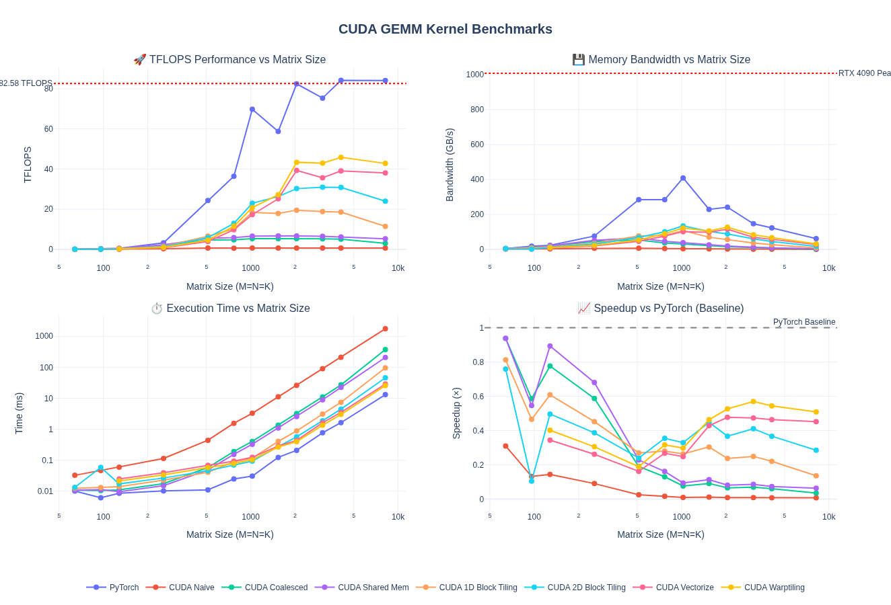

对于 4096×4096：

- **1.17× TFLOPS 提升**（39.07 → 45.82 TFLOPS）
- **PyTorch 的 54.4%**
- **比 naive 快 70.1×**

| Kernel | Time (ms) | TFLOPS | 相对 PyTorch |
|--------|-----------|--------|-------------|
| Naive | 210.29 | 0.65 | 0.8% |
| Coalesced | 26.95 | 5.10 | 6.1% |
| Shared Memory | 22.40 | 6.14 | 7.3% |
| 1D Block Tiling | 7.42 | 18.52 | 22.0% |
| 2D Block Tiling | 4.45 | 30.89 | 36.7% |
| Vectorized | 3.52 | 39.07 | 46.4% |
| **Warp Tiling** | **3.00** | **45.82** | **54.4%** |
| PyTorch | 1.63 | 84.19 | 100% |

不同矩阵大小的表现：

| Matrix Size | Time (ms) | TFLOPS | 相对 PyTorch |
|-------------|-----------|--------|-------------|
| 128×128 | 0.021 | 0.20 | 40.2% |
| 512×512 | 0.058 | 4.60 | 18.9% |
| 1024×1024 | 0.103 | 20.77 | 29.8% |
| 2048×2048 | 0.396 | 43.38 | 52.6% |
| 4096×4096 | 3.00 | 45.82 | 54.4% |
| 8192×8192 | 25.69 | 42.80 | 50.9% |

## 16-bit GEMM 基线

到目前为止只做了 FP32 kernel。现代工作负载越来越多使用 16 位浮点格式（FP16/BF16）甚至更低精度（FP8、FP4 等），以减少内存带宽需求并提升吞吐量。

将 warp tiling kernel 模板化以支持多种数据类型后（累加保持 FP32 以确保数值行为），FP16/BF16 基线性能如下：

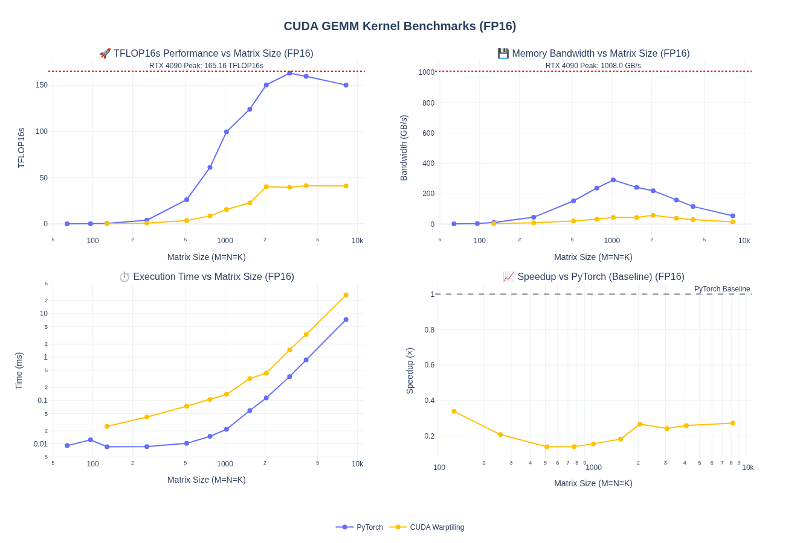

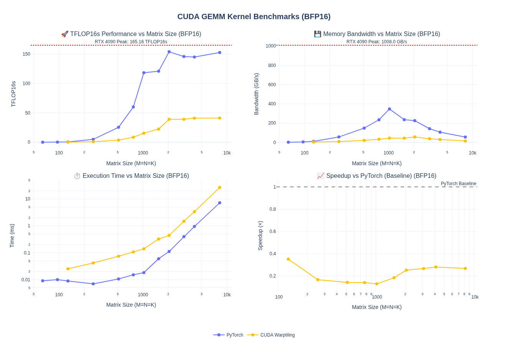

性能降到 PyTorch 的约 1/4——**没有 tensor core 无法匹配 PyTorch 性能**。下一步将引入 WMMA 和 Tensor Core。
