---
tags:
  - CUTLASS
  - CUDA
---

# Tensor Core 与 CUTLASS

> **原文**: [Learn CUTLASS the Hard Way!](https://www.kapilsharma.dev/posts/learn-cutlass-the-hard-way/) by Kapil Sharma
> **许可证**: [CC BY 4.0](https://creativecommons.org/licenses/by/4.0/) | **代码**: [gpusgobrr/explore-gemm](https://github.com/gpusgobrr/explore-gemm)
> 本文为原文的中文翻译与整理，交互式可视化部分已省略。

本文在 [上一篇](02_simt_tiling.md) warp tiling 的基础上，引入 Tensor Core、WMMA API、double buffering，最终过渡到 CUTLASS 库，并通过 swizzling、persistent kernel、autotuning 逼近 PyTorch 性能。

## WMMA 与 Tensor Core

之前的 warp tiling 结构可以用 NVIDIA WMMA API（Warp Matrix Multiply-Accumulate）实现。WMMA 扩展了 tiling 结构并暴露 Tensor Core MMA 操作。

### 什么是 Tensor Core？

Tensor Core 提供 warp 级集体 MMA 操作：warp 中 32 个线程集体持有 MMA 操作数。换言之，线程级寄存器外积可以直接下降到硬件执行。

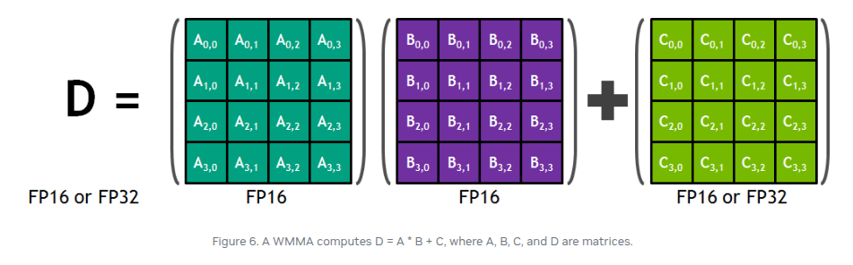

FP16 matmul + FP32 累加的典型用法：

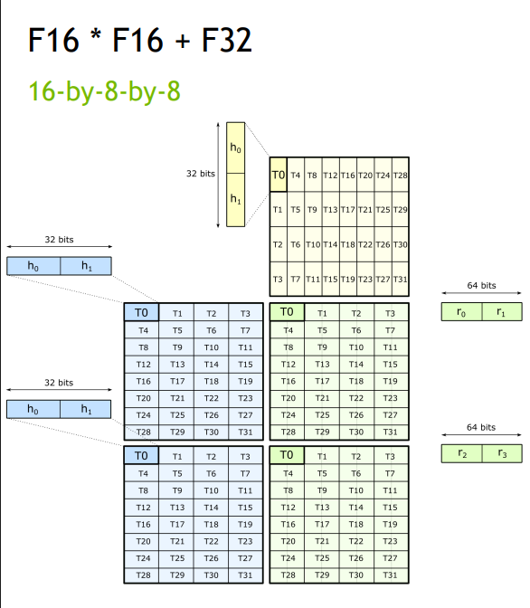

对应的 PTX 内联汇编：

```c
float D[4];
uint32_t const A[2];
uint32_t const B;
float const C[4];
asm(
    "mma.sync.aligned.m16n8k8.row.col.f32.f16.f16.f32 "
    " { %0, %1, %2, %3 }, "
    " { %4, %5}, "
    " %6, "
    " { %7, %8, %9, %10 };"
    :
    "=f"(D[0]), "=f"(D[1]), "=f"(D[2]), "=f"(D[3])
    :
    "r"(A[0]), "r"(A[1]),
    "r"(B),
    "f"(C[0]), "f"(C[1])
);
```

其中 `mma.sync.aligned.m16n8k8.row.col.f32.f16.f16.f32` 表示：

- 矩阵维度 M=16, N=8, K=8（计算 C[16×8] = A[16×8] × B[8×8] + C[16×8]）
- `row.col`：A 行主序、B 列主序
- `f32.f16.f16.f32`：输出 FP32，A/B 为 FP16，累加 FP32

### SM80 Tensor Core 指令

RTX 4090（Ada）上的 Tensor Core 操作：

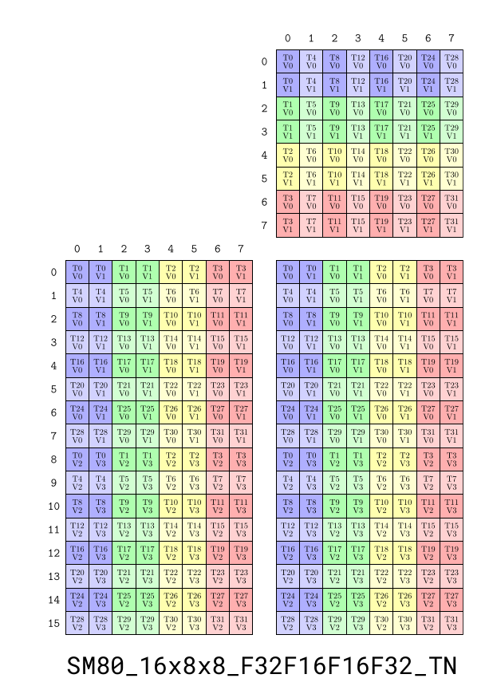

### WMMA GEMM Kernel

NVIDIA 提供的 Tensor Core 指令集允许 warp 级 matmul——在单条指令中计算 thread tile 矩阵乘法。引用 CUTLASS 原文：

> `wmma::load_matrix_sync` 将 A 和 B 的 fragment 加载到 `nvcuda::wmma::fragment<>` 模板实例中，累加器元素结构化为 `nvcuda::wmma::fragment<accumulator>` 数组。最后，`nvcuda::wmma::mma_sync()` 调用使用 Tensor Core 计算 warp 级 MMA 操作。

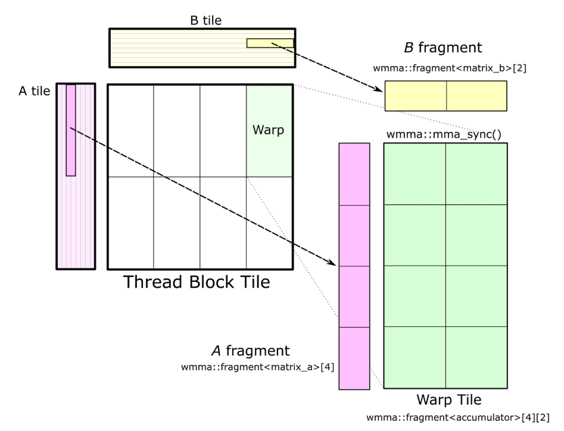

将之前的 warp tiling kernel 转换为 WMMA API，tile 大小直接映射：

```c
template <typename InputType,
            const int BLOCK_ROW_WARPS = 4,
            const int BLOCK_COL_WARPS = 4,
            const int WARP_ROW_TILES = 4,
            const int WARP_COL_TILES = 2,
            const int WMMA_M = 16,
            const int WMMA_N = 16,
            const int WMMA_K = 16>
__global__ void
sgemm_tensorcore_warptiled_kernel(int num_cols_b, int num_cols_a,
                                    float alpha, const InputType *matrix_a,
                                    const InputType *matrix_b, float beta,
                                    float *matrix_c)
{
    const uint warp_id = threadIdx.x / 32;
    const uint warp_row = warp_id / BLOCK_COL_WARPS;
    const uint warp_col = warp_id % BLOCK_COL_WARPS;

    constexpr int BLOCK_ROW_TILES = WARP_ROW_TILES * BLOCK_ROW_WARPS;
    constexpr int BLOCK_COL_TILES = WARP_COL_TILES * BLOCK_COL_WARPS;
    constexpr int BM = BLOCK_ROW_TILES * WMMA_M;
    constexpr int BN = BLOCK_COL_TILES * WMMA_N;
    constexpr int BK = WMMA_K;

    __shared__ InputType tile_a[BM * BK];
    __shared__ InputType tile_b[BK * BN];

    '''
    WMMA fragment 声明
    - a_frag: 行主序 A fragment
    - b_frag: 列主序 B fragment（与 SMEM 布局匹配）
    - acc_frag: FP32 累加器，每 warp WARP_ROW_TILES × WARP_COL_TILES 个
    '''
    nvcuda::wmma::fragment<nvcuda::wmma::matrix_a, WMMA_M, WMMA_N, WMMA_K,
                           InputType, nvcuda::wmma::row_major> a_frag;
    nvcuda::wmma::fragment<nvcuda::wmma::matrix_b, WMMA_M, WMMA_N, WMMA_K,
                           InputType, nvcuda::wmma::col_major> b_frag;
    nvcuda::wmma::fragment<nvcuda::wmma::accumulator, WMMA_M, WMMA_N, WMMA_K,
                           float> acc_frag[WARP_ROW_TILES][WARP_COL_TILES];
    nvcuda::wmma::fragment<nvcuda::wmma::accumulator, WMMA_M, WMMA_N, WMMA_K,
                           float> c_frag;

    for (int i = 0; i < WARP_ROW_TILES; ++i)
        for (int j = 0; j < WARP_COL_TILES; ++j)
            nvcuda::wmma::fill_fragment(acc_frag[i][j], 0.0f);

    constexpr int NUM_THREADS = BLOCK_ROW_WARPS * BLOCK_COL_WARPS * 32;

    '''
    K 维循环：加载 tile → WMMA 操作
    A: BM × BK 行主序，B: BK × BN 列主序（转置存储）
    '''
    for (int block_k_idx = 0; block_k_idx < num_cols_a; block_k_idx += BK)
    {
        for (int idx = threadIdx.x; idx < BM * BK; idx += NUM_THREADS)
        {
            int row = idx / BK, col = idx % BK;
            int global_row = blockIdx.y * BM + row;
            int global_col = block_k_idx + col;
            tile_a[row * BK + col] = matrix_a[global_row * num_cols_a + global_col];
        }

        for (int idx = threadIdx.x; idx < BK * BN; idx += NUM_THREADS)
        {
            int row = idx / BN, col = idx % BN;
            int global_row = block_k_idx + row;
            int global_col = blockIdx.x * BN + col;
            tile_b[col * BK + row] = matrix_b[global_row * num_cols_b + global_col];  // 转置
        }

        __syncthreads();

        '''
        Warp 级 WMMA 计算
        每个 warp 处理 WARP_ROW_TILES × WARP_COL_TILES 个 16×16 tile
        '''
        for (int i = 0; i < WARP_ROW_TILES; ++i)
        {
            for (int j = 0; j < WARP_COL_TILES; ++j)
            {
                int a_tile_row = warp_row * WARP_ROW_TILES + i;
                int b_tile_col = warp_col * WARP_COL_TILES + j;

                nvcuda::wmma::load_matrix_sync(a_frag,
                    tile_a + (a_tile_row * WMMA_M) * BK, BK);
                nvcuda::wmma::load_matrix_sync(b_frag,
                    tile_b + (b_tile_col * WMMA_N) * BK, BK);
                nvcuda::wmma::mma_sync(acc_frag[i][j], a_frag, b_frag, acc_frag[i][j]);
            }
        }

        __syncthreads();
    }

    '''
    结果写回：C = alpha * (A * B) + beta * C
    '''
    for (int i = 0; i < WARP_ROW_TILES; ++i)
    {
        for (int j = 0; j < WARP_COL_TILES; ++j)
        {
            int global_row = blockIdx.y * BM + (warp_row * WARP_ROW_TILES + i) * WMMA_M;
            int global_col = blockIdx.x * BN + (warp_col * WARP_COL_TILES + j) * WMMA_N;
            float *c_ptr = matrix_c + global_row * num_cols_b + global_col;

            nvcuda::wmma::load_matrix_sync(c_frag, c_ptr, num_cols_b,
                                           nvcuda::wmma::mem_row_major);
            for (int t = 0; t < c_frag.num_elements; ++t)
                c_frag.x[t] = alpha * acc_frag[i][j].x[t] + beta * c_frag.x[t];
            nvcuda::wmma::store_matrix_sync(c_ptr, c_frag, num_cols_b,
                                            nvcuda::wmma::mem_row_major);
        }
    }
}
```

### 性能

Tensor Core warp tiling 比不带 TC 的版本有改进，且数值计算由 WMMA 抽象处理更好：

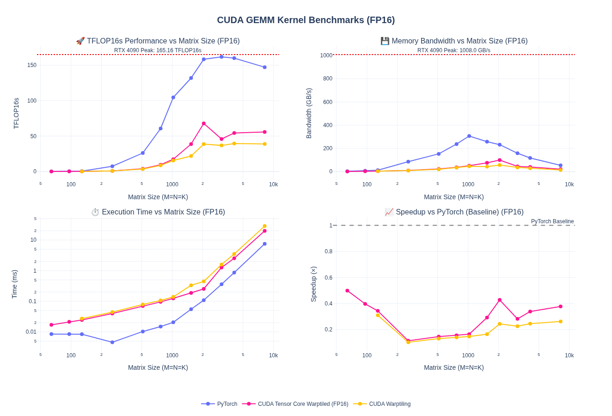

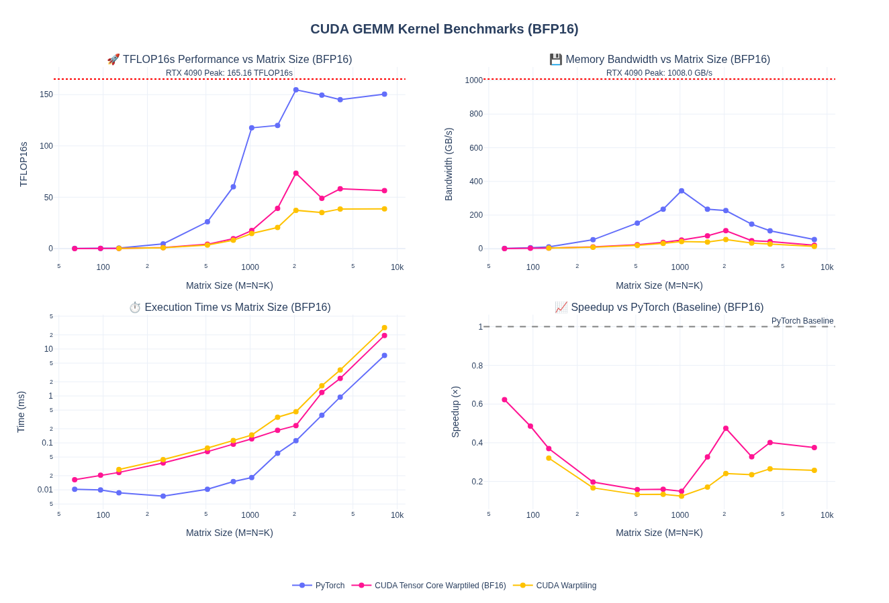

| Matrix Size | FP16 TFLOPS | BF16 TFLOPS | FP16 vs PyTorch | BF16 vs PyTorch |
|-------------|-------------|-------------|-----------------|-----------------|
| 1024×1024 | 17.3 | 17.5 | 17.8% | 14.9% |
| 2048×2048 | 67.9 | 73.4 | 42.8% | 47.5% |
| 4096×4096 | 55.4 | 58.2 | 34.4% | 40.1% |
| 8192×8192 | 55.9 | 56.5 | 38.7% | 37.5% |

### NCU 验证

NCU profiling 确认了 Tensor Core 指令的使用：

**不带 TC 的 BF16 Warp Tiling**：使用 FMUL/FFMA 标量指令

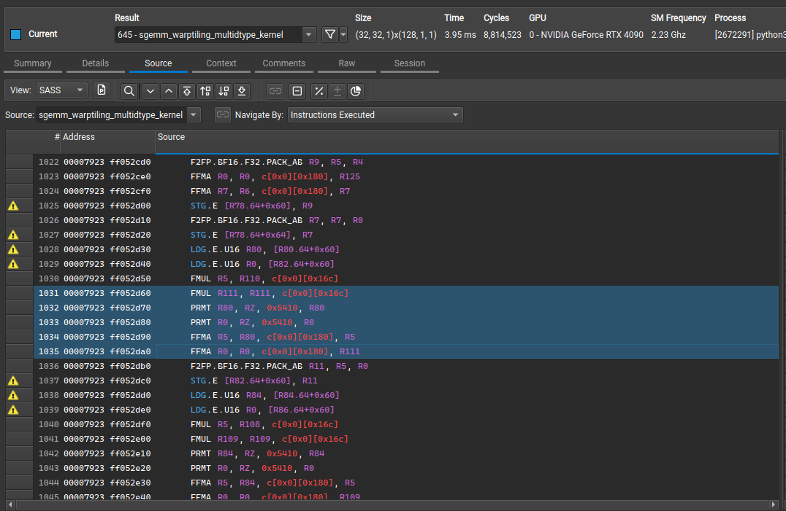

```
FMUL R111, R111, c[0x0][0x16c]
FFMA R5, R80, c[0x0][0x180], R5
```

**带 TC 的 Warp Tiling**：使用 HMMA（Half-precision MMA）指令

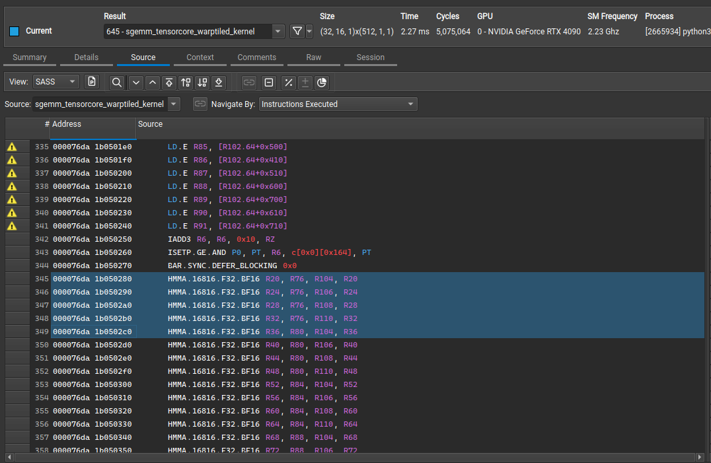

```
HMMA.16816.F32.BF16 R20, R76, R104, R20
HMMA.16816.F32.BF16 R24, R76, R106, R24
```

PyTorch matmul 的 NCU profile 也使用相同指令：

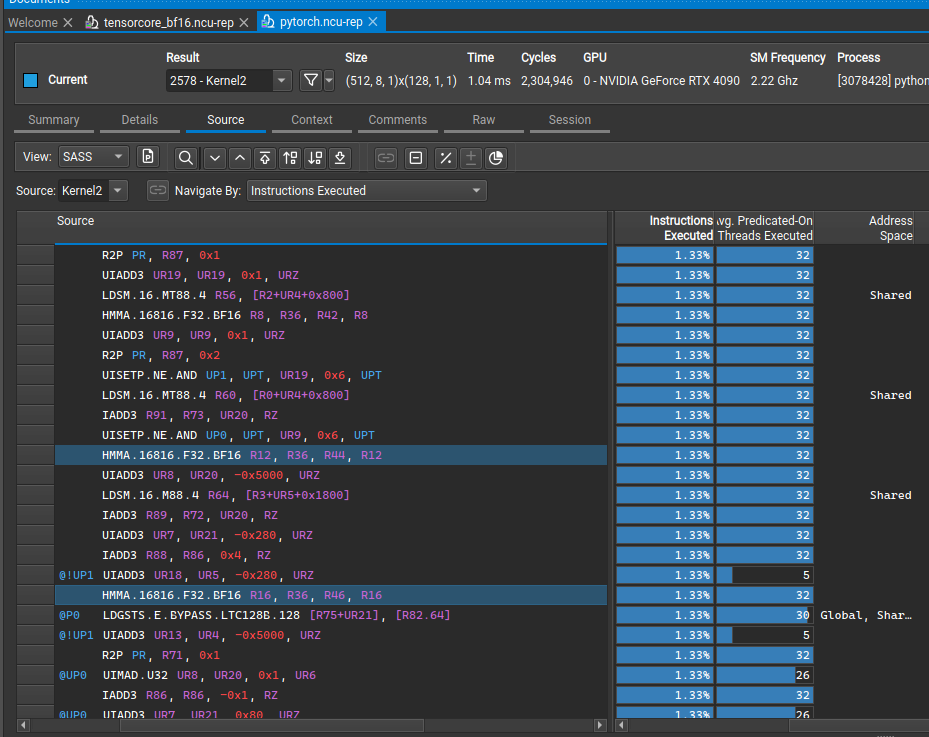

## Double Buffering

如果把 matmul 看作异步问题，本质上是生产者-消费者问题。生产者尽快从 global → shared → registers 搬运数据，消费者尽快计算 MMA 指令。Double buffering 就是在一个 buffer 上计算的同时填充另一个 buffer。也叫 software pipelining——重叠内存访问与计算。

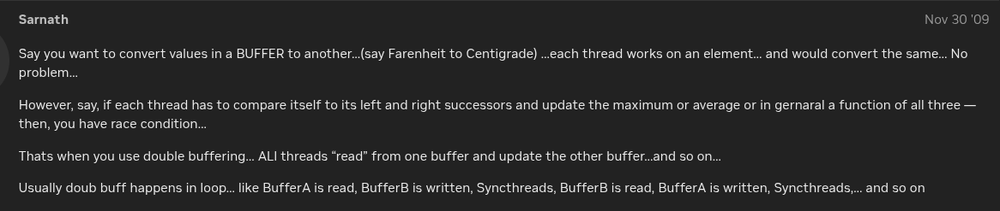

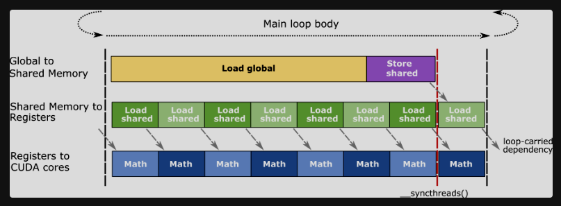

实现方式：创建两块 shared memory——一个读 buffer，一个写 buffer：

```c
__shared__ InputType tile_a[2][BM * BK];
__shared__ InputType tile_b[2][BK * BN];
```

### Kernel

核心思路：prologue 加载第一个 tile 到 buffer 0，主循环中从 read_buffer 计算的同时将下一个 tile 预取到 write_buffer：

```c
int read_buffer = 0;

// Prologue: 加载第一个 tile 到 buffer 0
{
    // ... 标量加载 tile_a[0] 和 tile_b[0] ...
}
__syncthreads();

// 主 K 循环
for (int block_k_idx = 0; block_k_idx < num_cols_a; block_k_idx += BK)
{
    int write_buffer = read_buffer ^ 1;  // 在 0 和 1 之间切换

    // 预取下一个 tile 到 write_buffer（如果不是最后一轮）
    if (block_k_idx + BK < num_cols_a)
    {
        // ... 加载 tile_a[write_buffer] 和 tile_b[write_buffer] ...
    }

    // 用当前 read_buffer 计算 WMMA
    for (int i = 0; i < WARP_ROW_TILES; ++i)
        for (int j = 0; j < WARP_COL_TILES; ++j)
        {
            nvcuda::wmma::load_matrix_sync(a_frag,
                tile_a[read_buffer] + (a_tile_row * WMMA_M) * BK, BK);
            nvcuda::wmma::load_matrix_sync(b_frag,
                tile_b[read_buffer] + (b_tile_col * WMMA_N) * BK, BK);
            nvcuda::wmma::mma_sync(acc_frag[i][j], a_frag, b_frag, acc_frag[i][j]);
        }

    __syncthreads();
    read_buffer = write_buffer;  // 切换 buffer
}
```

### 性能分析

Double buffering 带来了 30+% 的性能提升：

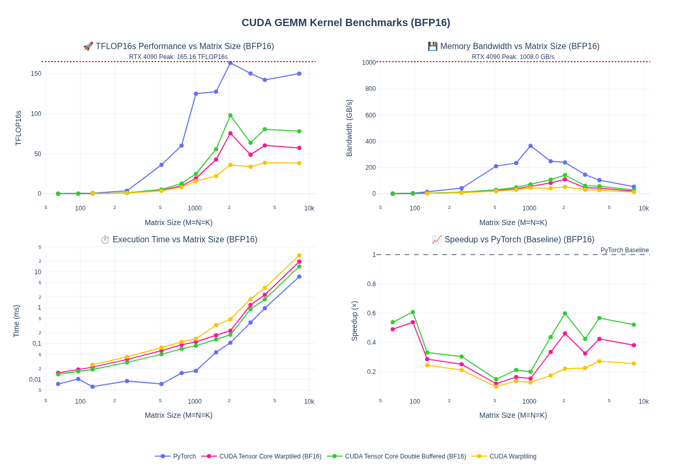

## CUTLASS

现在有了足够的基础理解，可以使用 CUTLASS 了。经过之前 10+ 个 kernel 的铺垫，CUTLASS 代码变得不言自明——这正是整个"Hard Way"的目的。

### 什么是 CUTLASS

CUTLASS 最初是层次化 GEMM 结构的实现，提供高效 GEMM kernel 的 CUDA C++ 模板类。底层 tile loader 高效地在 global → shared → registers 之间搬运数据。此外还提供 Epilogue 等原语，可将下游操作（如逐元素操作、reduction）与 GEMM 融合。

CUTLASS 提供两套主要 API：
- Gemm API：`cutlass::gemm::device::Gemm`（CUTLASS 2.x 风格）
- Collective Builders API：`cutlass::gemm::collective::CollectiveBuilder`（3.x 风格）

本文使用 CUTLASS 2.x 的 Gemm API。

### Kernel

```cpp
#include "cutlass/cutlass.h"
#include "cutlass/gemm/device/gemm.h"
#include "cutlass/epilogue/thread/linear_combination.h"

using ElementAccumulator = float;
using ElementOutput = float;

using LayoutA = cutlass::layout::RowMajor;
using LayoutB = cutlass::layout::RowMajor;
using LayoutC = cutlass::layout::RowMajor;

using ThreadBlockShape = cutlass::gemm::GemmShape<128, 128, 32>;  // BM, BN, BK
using WarpShape = cutlass::gemm::GemmShape<64, 64, 32>;           // WM, WN, WK
using InstructionShape = cutlass::gemm::GemmShape<16, 8, 16>;     // Tensor Core shape

template <typename InputElementType>
struct CutlassGemmConfig
{
    using ElementInput = InputElementType;

    using EpilogueOp = cutlass::epilogue::thread::LinearCombination<
        ElementOutput,
        128 / cutlass::sizeof_bits<ElementOutput>::value>;

    using Gemm = cutlass::gemm::device::Gemm<
        ElementInput, LayoutA,
        ElementInput, LayoutB,
        ElementOutput, LayoutC,
        ElementAccumulator,
        cutlass::arch::OpClassTensorOp,
        cutlass::arch::Sm80,
        ThreadBlockShape,
        WarpShape,
        InstructionShape,
        EpilogueOp>;
};

using FP16Config = CutlassGemmConfig<cutlass::half_t>;
using BF16Config = CutlassGemmConfig<cutlass::bfloat16_t>;

template <typename Config>
cudaError_t cutlass_gemm_launch(
    int M, int N, int K,
    const typename Config::ElementInput *d_A, int lda,
    const typename Config::ElementInput *d_B, int ldb,
    ElementOutput *d_C, int ldc,
    float alpha, float beta, cudaStream_t stream = nullptr)
{
    typename Config::Gemm gemm_op;
    typename Config::Gemm::Arguments args(
        {M, N, K},
        {d_A, lda}, {d_B, ldb}, {d_C, ldc}, {d_C, ldc},
        {alpha, beta});

    cutlass::Status status = gemm_op.can_implement(args);
    if (status != cutlass::Status::kSuccess)
        return cudaErrorNotSupported;

    status = gemm_op.initialize(args, nullptr, stream);
    if (status != cutlass::Status::kSuccess)
        return cudaErrorUnknown;

    status = gemm_op(stream);
    return (status == cutlass::Status::kSuccess) ? cudaSuccess : cudaErrorUnknown;
}
```

### 性能分析

相比之前最好的 double buffered kernel，CUTLASS 性能几乎翻倍。大矩阵大小上接近 PyTorch：

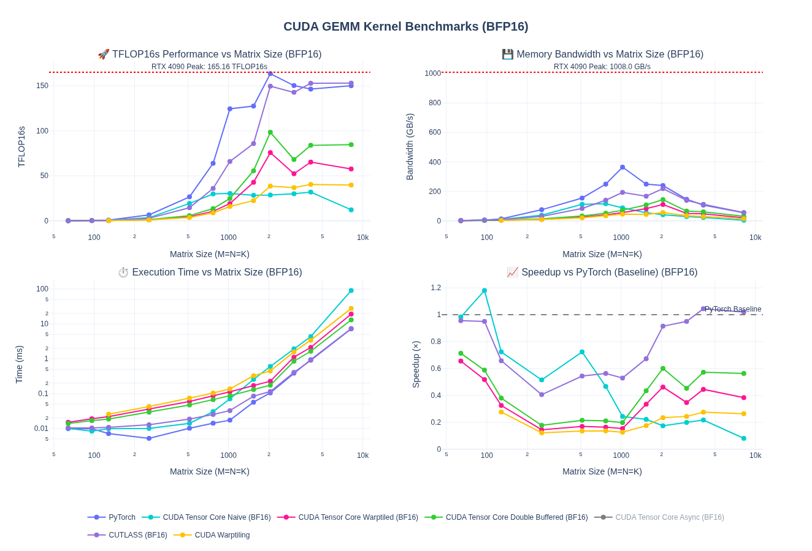

| Matrix Size | PyTorch TFLOPS | CUTLASS TFLOPS | CUTLASS vs PyTorch |
|-------------|---------------|---------------|-------------------|
| 512×512 | 26.5 | 14.4 | 0.54× |
| 1024×1024 | 124.5 | 66.0 | 0.53× |
| 2048×2048 | 163.6 | 149.7 | 0.91× |
| 4096×4096 | 146.4 | 152.9 | **1.04×** |
| 8192×8192 | 150.2 | 153.1 | **1.02×** |

Gemm API 还有两个重要模板参数值得进一步探索：`ThreadblockSwizzle_` 和 `Stages`。

## Swizzling

### Bank Conflict

Shared memory 分为 32 个 bank，每个 bank 每周期服务一个 32 位字。当 warp 中两个或更多线程访问映射到同一 bank 的不同地址时，访问必须串行化——导致性能损失。

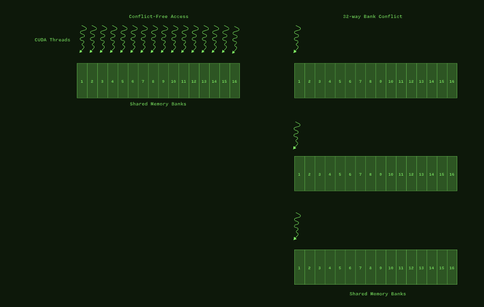

GEMM 中每个 thread block 反复将 A 和 B 的 tile 加载到 shared memory。由于加载高度结构化，朴素布局容易产生严重 bank conflict。

### Swizzling 如何帮助？

Swizzling 是地址重映射技术——改变数据在 shared memory 中的布局以最小化 bank conflict。通过调整低位地址位，使同一 warp 中连续线程访问不同 bank。

**线性布局**：`bank = (address / 4) % 32`

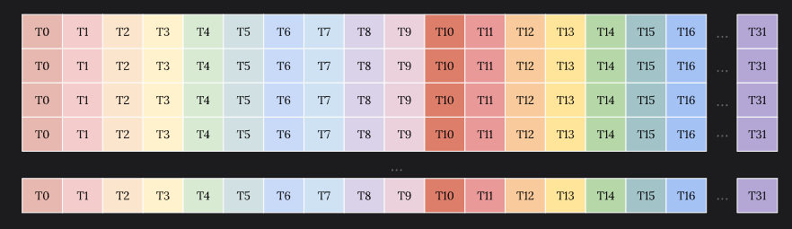

**Swizzled 布局**：`(o / 32, (o % 32) xor (o / 32))`

用 XOR 交换对，将相同数据重映射到不同内存位置：

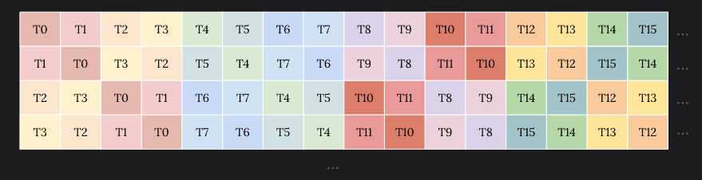

NVIDIA 文档中的更多 swizzling 模式：

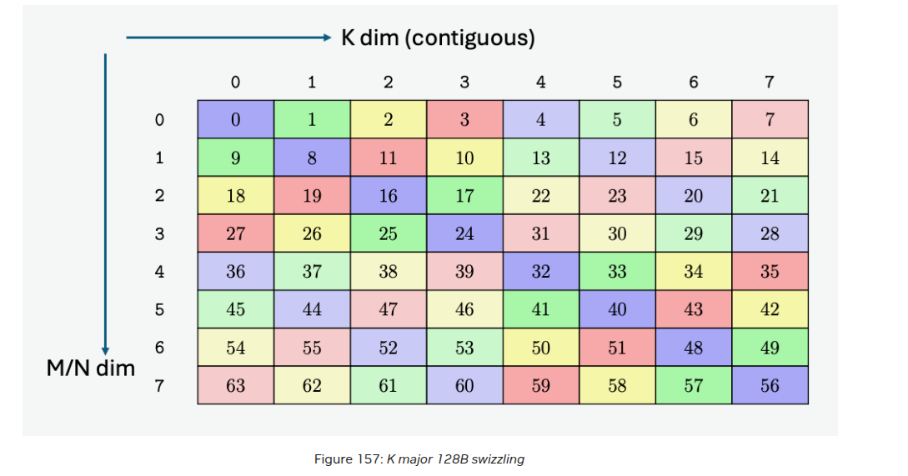

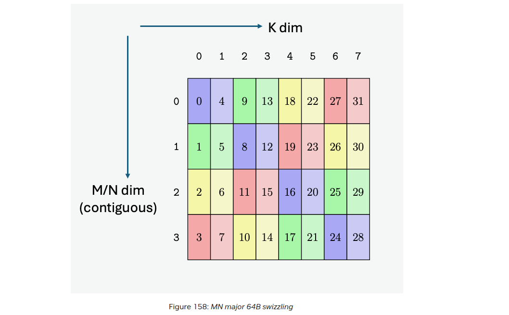

关键要点：为避免 bank conflict，将 shared memory 布局重映射为 swizzled 布局，确保线程不争用相同硬件资源（bank）。

## Persistent Kernel / Software Pipelining

Software pipelining / persistent kernel 是 double buffering 的自然扩展——将 shared memory buffer 数量从 2 扩展到 N（N 级流水线）。

**Persistent Kernel** 的概念：GEMM kernel "保持活跃"，将不同的 stage 异步重叠。目标是让加载、计算、kernel 启动、epilogue、prologue 等持续运行：

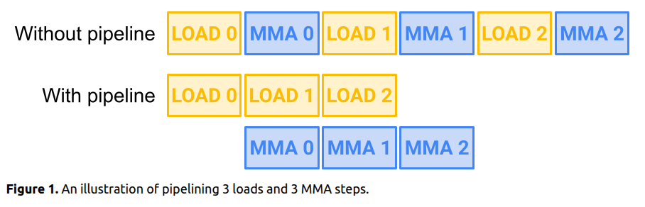

Phil Tillet（GTC 25）关于 Blackwell 上计算与加载重叠的演示：

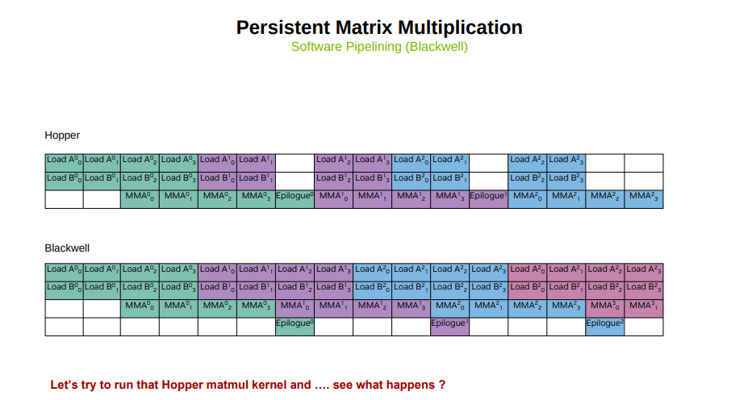

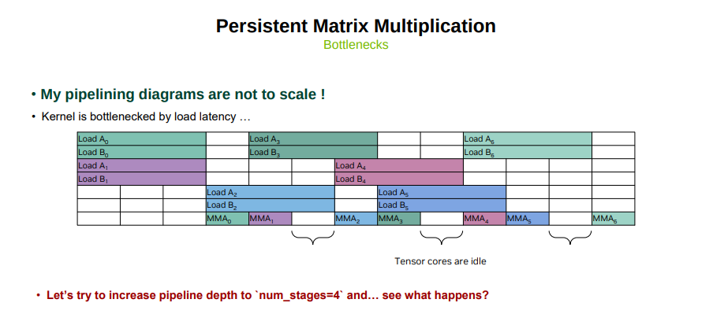

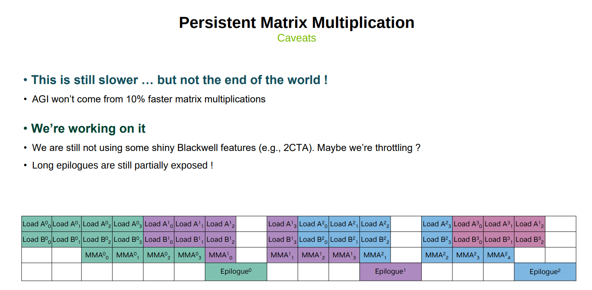

## Autotuning

使用 autotuning 为不同 tensor 大小找最优配置。定义调优参数结构：

```cpp
struct GemmConfigEntry
{
    int BM, BN, BK;
    int WM, WN, WK;
    int IM, IN, IK;
    int stages;
};
```

在 20 种不同 CUTLASS 配置中搜索，覆盖各种 tile 大小和 pipeline stage 数：

```cpp
constexpr GemmConfigEntry kConfigs[] = {
    {128, 256, 64, 64, 64, 64, 16, 8, 16, 3},
    {64, 256, 32, 32, 64, 32, 16, 8, 16, 4},
    {128, 128, 32, 64, 64, 32, 16, 8, 16, 4},
    {128, 64, 32, 64, 32, 32, 16, 8, 16, 4},
    // ... 共 20 种配置
};
```

### Autotuning 结果

经过 autotuning，所有矩阵大小上都能一致超越 PyTorch：

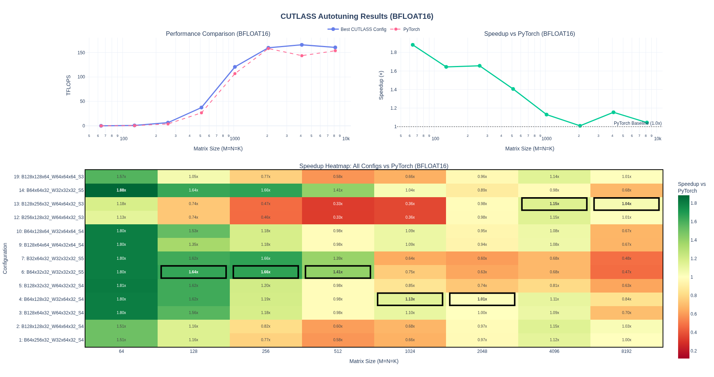

- **小矩阵（64-512）**：发现比 PyTorch 快达 **2.0×** 的配置，较大 thread block（128×64×32）和 4-5 级 pipeline stage 效果好
- **中矩阵（1024-2048）**：接近 PyTorch，加速比达 **1.09×**
- **大矩阵（4096-8192）**：性能更好，最高 15% 加速

同时也对比了 Triton persistent kernel 实现，但性能较差（可能未针对该硬件完全优化）：

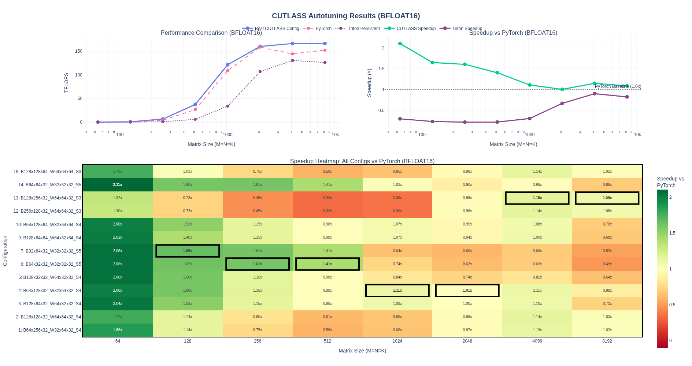

## 后记

本文的目标是从"shared memory cache"的 CUDA 教程层面深入到真正理解现代 GEMM 优化。后续探索方向包括：

- 在 Hopper 和 Blackwell 硬件上运行（见 [下一篇](04_hopper_cutlass3x.md)）
- FP8 / MXFP4 / MXFP8 变体
- CUTLASS 3.x 和 4.x API
- CuTe Python DSL
- Grouped GEMM 等其他 kernel

## 参考资料

- [Simon Boehm's CUDA Matrix Multiplication](https://siboehm.com/articles/22/CUDA-MMM)
- [NVIDIA CUDA C Programming Guide](https://docs.nvidia.com/cuda/cuda-c-programming-guide/)
- [CUTLASS: Fast Linear Algebra in CUDA C++](https://developer.nvidia.com/blog/cutlass-linear-algebra-cuda/)
- [Triton Tutorial: Matrix Multiplication](https://triton-lang.org/main/getting-started/tutorials/03-matrix-multiplication.html)
- [Lei.Chat: Triton Linear Layout](https://www.lei.chat/posts/triton-linear-layout-concept/)
- [Colfax Research: CUTLASS Tutorial - Design of a GEMM Kernel](https://research.colfax-intl.com/cutlass-tutorial-design-of-a-gemm-kernel/)
- [Colfax Research: CUTLASS Tutorial - WGMMA on Hopper](https://research.colfax-intl.com/cutlass-tutorial-wgmma-hopper/)
- [Outperforming cuBLAS on H100: a Worklog](https://cudaforfun.substack.com/p/outperforming-cublas-on-h100-a-worklog)
- [Modal GPU Glossary](https://modal.com/gpu-glossary/readme)
