---
tags:
  - CUTLASS
  - CUDA
---

# Hopper 架构与 CUTLASS 3.x

> **原文**: [Learn CUTLASS the Hard Way - Part 2!](https://www.kapilsharma.dev/posts/learn-cutlass-the-hard-way-2/) by Kapil Sharma
> **许可证**: [CC BY 4.0](https://creativecommons.org/licenses/by/4.0/) | **代码**: [gpusgobrr/explore-gemm](https://github.com/gpusgobrr/explore-gemm)
> 本文为原文的中文翻译与整理，交互式可视化部分已省略。

本文是 [上一篇](03_tensorcore_and_cutlass.md) 的延续，探索 Hopper（H100）架构上的 GEMM 优化。Hopper 引入了多项新特性（TBC、TMA、WGMMA 等），对 16-bit 及更低精度 GEMM 性能有巨大影响。本文使用 CUTLASS 3.x API 逐步逼近 PyTorch/cuBLAS 性能。

## 基线测试

在进入 Hopper 专属 kernel 之前，先将 [上一篇](03_tensorcore_and_cutlass.md) 为 Ada（RTX 4090）编写的 CUTLASS 2.x kernel 在 H100 上运行作为基线。

### Ada Kernel 直接运行

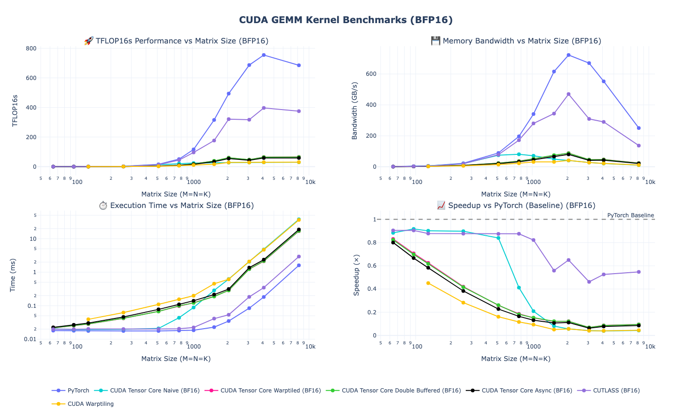

- **小矩阵**：两者都受内存带宽限制
- **中等矩阵**：性能显著分化，Ada kernel 在 H100 上封顶约 300 TFLOPS
- **大矩阵**：差距进一步拉大，Ada kernel 峰值约 400 TFLOPS，PyTorch 持续扩展直到 compute-bound

### Autotuned Ada Kernel

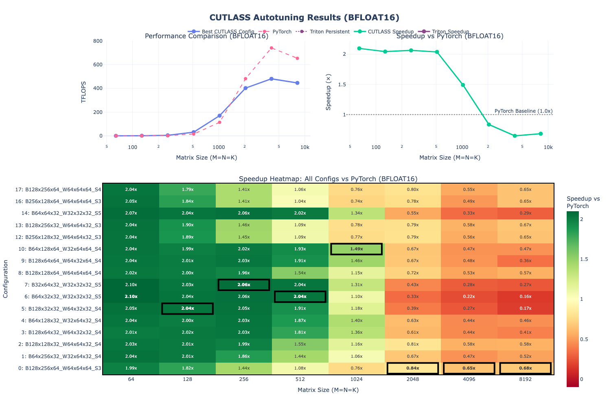

Autotuning 在小 GEMM 上取得约 2× 提升（可能是更好的寄存器使用），但大矩阵上仍无法发挥 H100 的全部潜力。

## Hopper 架构关键变化

### Thread Block Clusters（TBC）

Hopper 在 thread block 之上新增了 **Thread Block Cluster** 层次——最多 8 个 thread block 组成一个 cluster，可以协作。cluster 内的 thread block 可以直接访问彼此的 shared memory（分布式 shared memory），无需经过 global memory。这使得跨 block 的数据复用成为可能。

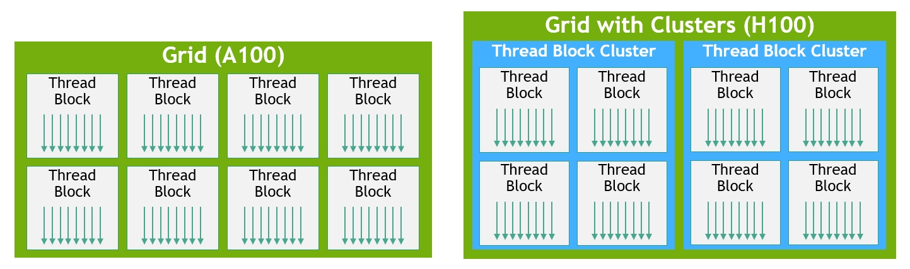

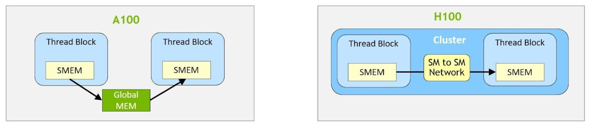

*来源: [NVIDIA Hopper Architecture in Depth](https://developer.nvidia.com/blog/nvidia-hopper-architecture-in-depth/)*

### Tensor Memory Accelerator（TMA）

TMA 是 Hopper 最重要的架构变化之一。TMA 提供了一种新的张量搬运方式——从 global memory 到 shared memory 的数据传输**绕过寄存器文件**，直接读写 shared memory。此外，数据可以通过 multicast 发送到 cluster 内的多个 thread block。

TMA 操作是异步的，使用基于 shared memory 的 barrier。warp 中只有一个线程发起 `cuda::memcpy_async`，其余线程在 barrier 上等待。这释放了线程去做有用的计算。


*来源: [NVIDIA Hopper Architecture in Depth](https://developer.nvidia.com/blog/nvidia-hopper-architecture-in-depth/)*

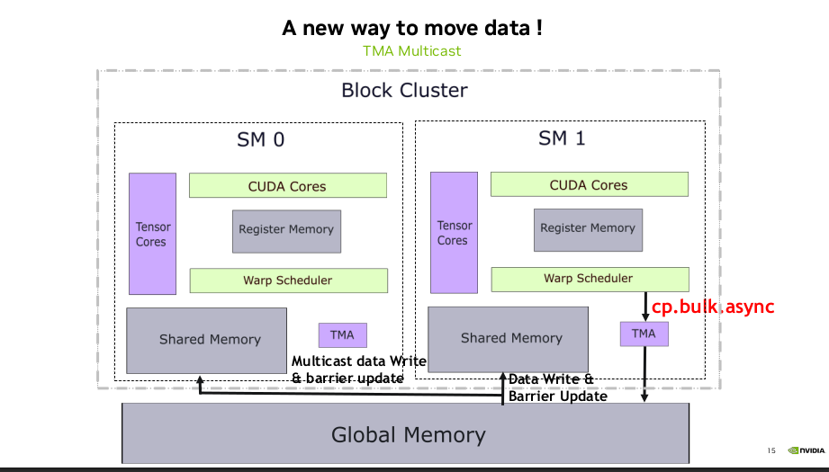

*来源: [Developing Optimal CUDA Kernels on Hopper Tensor Cores](https://www.nvidia.com/en-us/on-demand/session/gtcspring23-s51413/)*

### 异步事务屏障（Asynchronous Transaction Barriers）

Ampere 引入了异步屏障，将同步拆为两个非阻塞步骤：**Arrive**（线程通知已完成生产数据，可继续做其他工作）和 **Wait**（线程仅在实际需要结果时才阻塞）。Hopper 进一步增强：等待线程可以**休眠**而非自旋，减少浪费的周期。

Hopper 还引入了**异步事务屏障**：除了 Arrive 和 Wait，还跟踪已产生的数据量。线程的 Arrive 操作附带事务（字节）计数，Wait 步骤同时检查两个条件：所有线程已到达，且总数据量达到指定阈值。

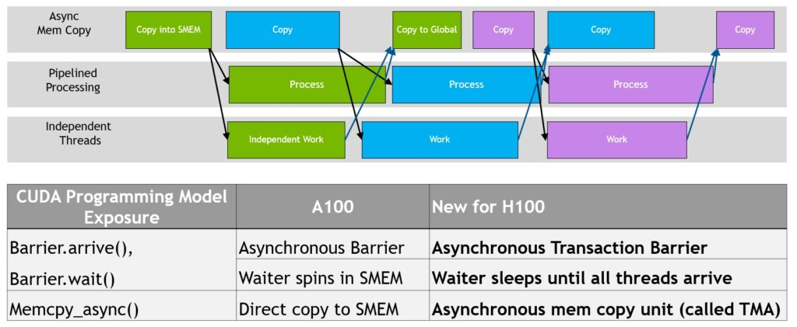

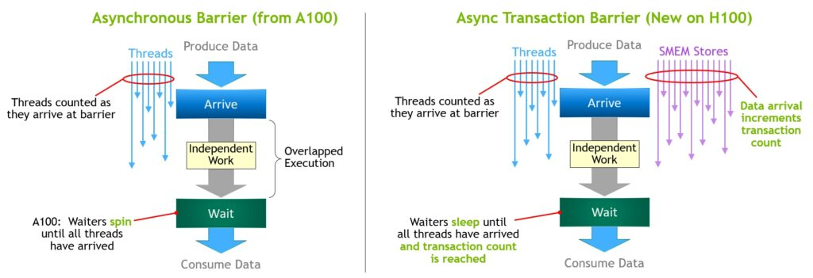

*来源: [Developing Optimal CUDA Kernels on Hopper Tensor Cores](https://www.nvidia.com/en-us/on-demand/session/gtcspring23-s51413/)*

### Warp Group 指令（WGMMA）

Hopper 引入了异步 warp group 级矩阵乘累加操作（WGMMA）。一个 warp group 由 4 个连续 warp（128 个线程）组成。`wgmma.mma_async` 指令由 warp group 内所有 128 个线程集体执行。

BF16 密集计算支持的矩阵形状：`m64nXk16`，其中 N 从 8 到 256，步长为 8。

### 其他特性

- **原生 FP8 支持**：E4M3 和 E5M2 两种格式
- **更大 L2 Cache**：50 MB（A100 为 40 MB）

## CUTLASS 3.x 与 Hopper 支持

CUTLASS 3.x 为 Hopper+ 架构引入了新的五层 GEMM 层次结构。

之前 CUTLASS 2.x 的层次基于硬件层次：

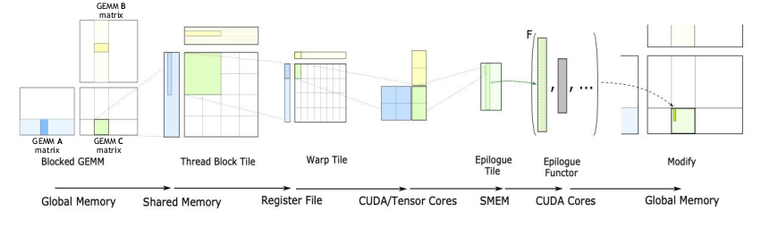

CUTLASS 3.x 改为基于**概念层次**：

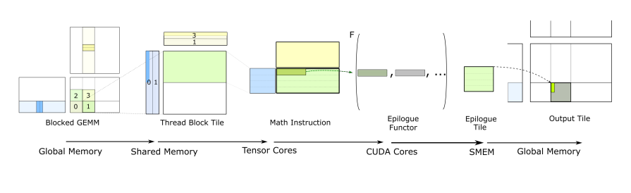

**Collective 层**是 Hopper+ kernel 的关键——负责编排生产者-消费者模式：生产者 warp 发起 TMA 加载，消费者 warp 执行 WGMMA 操作，通过异步事务屏障协调。

### Warp Specialization

[Warp specialization](https://docs.nvidia.com/cuda/cuda-c-programming-guide/#spatial-partitioning-also-known-as-warp-specialization)（也叫空间分区）是一种将 thread block 内不同 warp 分配到不同角色的技术。不同于所有 warp 对不同数据执行相同操作，专用 warp 专注于特定任务——有的负责数据搬运，有的负责计算。

这种模式在 GEMM 转向异步生产者/消费者范式后变得至关重要：
- 避免单个 warp 持有所有所需的寄存器和 shared memory 资源
- 更高效地处理内存加载/TMA 的不可预测延迟
- 减少"气泡"——部分 warp 可继续执行，而其他 warp 等待阻塞操作

## TMA Warp Specialized Kernel

### 基础版本（2-Stage）

从基础 TMA Warp Specialized 版本开始。定义元素类型和布局：

```cpp
using ElementA = cutlass::bfloat16_t;
using ElementB = ElementType;
using ElementC = float;
using ElementD = float;
using ElementAccumulator = float;

using LayoutA = cutlass::layout::RowMajor;
using LayoutB = cutlass::layout::RowMajor;
using LayoutC = cutlass::layout::RowMajor;
using LayoutD = cutlass::layout::RowMajor;

// 16-byte 对齐（TMA 要求）
static constexpr int AlignmentA = 128 / cutlass::sizeof_bits<ElementA>::value;
static constexpr int AlignmentB = 128 / cutlass::sizeof_bits<ElementB>::value;
```

定义 TileShape 和 Cluster Shape：

```cpp
using TileShape = Shape<_128, _128, _64>;  // CTA tile (M, N, K)
using ClusterShape = Shape<_1, _1, _1>;    // 不使用 TBC
```

定义 GEMM Op，使用 2-Stage pipeline：

```cpp
'''
Warp Specialized TMA kernel：
- KernelSchedule: TMA warp specialized（生产者/消费者分离）
- StageCount<2>: 2 级 software pipeline
- CollectiveBuilder: 自动构建 mainloop 和 epilogue
'''
using KernelSchedule = cutlass::gemm::KernelTmaWarpSpecialized;
using EpilogueSchedule = cutlass::epilogue::TmaWarpSpecialized;

using CollectiveMainloop = typename cutlass::gemm::collective::CollectiveBuilder<
    cutlass::arch::Sm90,
    cutlass::arch::OpClassTensorOp,
    ElementA, LayoutA, AlignmentA,
    ElementB, LayoutB, AlignmentB,
    ElementAccumulator,
    TileShape,
    ClusterShape,
    cutlass::gemm::collective::StageCount<2>,  // 2 stages 硬编码
    KernelSchedule>::CollectiveOp;

using CollectiveEpilogue = typename cutlass::epilogue::collective::CollectiveBuilder<
    cutlass::arch::Sm90,
    cutlass::arch::OpClassTensorOp,
    TileShape,
    ClusterShape,
    cutlass::epilogue::collective::EpilogueTileAuto,
    ElementAccumulator,
    ElementAccumulator,
    ElementC, LayoutC, AlignmentC,
    ElementD, LayoutD, AlignmentD,
    EpilogueSchedule>::CollectiveOp;

using GemmKernel = cutlass::gemm::kernel::GemmUniversal<
    Shape<int, int, int>,
    CollectiveMainloop,
    CollectiveEpilogue>;

using Gemm = cutlass::gemm::device::GemmUniversalAdapter<GemmKernel>;
```

Stride 定义使用 CuTe 工具：

```cpp
auto problem_shape = make_shape(M, N, K);

using StrideA = typename Config::GemmKernel::StrideA;
using StrideB = typename Config::GemmKernel::StrideB;

auto stride_A = cutlass::make_cute_packed_stride(StrideA{}, {M, K, 1});
auto stride_B = cutlass::make_cute_packed_stride(StrideB{}, {N, K, 1});
auto stride_C = cutlass::make_cute_packed_stride(StrideC{}, {M, N, 1});
auto stride_D = cutlass::make_cute_packed_stride(StrideD{}, {M, N, 1});
```

### 2-Stage 性能

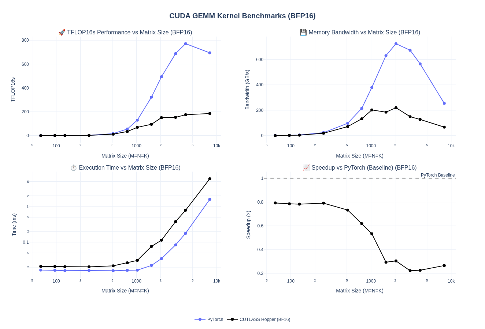

大矩阵性能仅为 PyTorch 的 20-25%——实际上比 CUTLASS 2.x 基线还差。

NCU Speed of Light 分析确认 SM 和 Memory 吞吐量都很差：

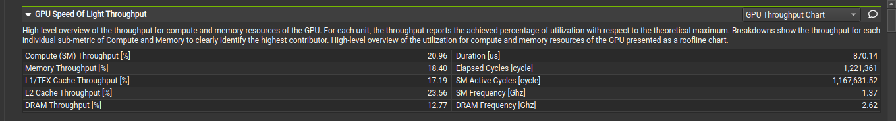

### Auto Stage Count

将 stage 数从硬编码的 2 改为 Auto：

```diff
- cutlass::gemm::collective::StageCount<2>,  // 2 stages 硬编码
+ cutlass::gemm::collective::StageCountAuto,
```

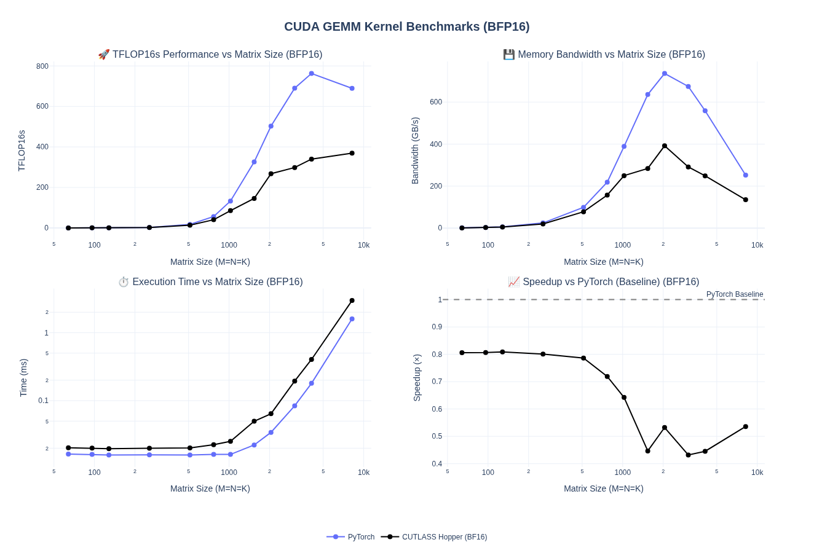

中大矩阵性能几乎翻倍，小矩阵略有改善。

NCU 分析显示 TFLOPS 提升与 SM/Memory 吞吐量直接成正比：

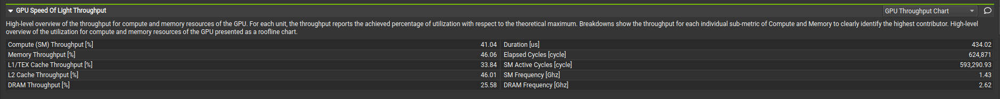

Memory Chart 显示 L2 cache 命中率从 63% 提升到 73%，但 `DSMEM` 输入输出为 0——因为 ClusterShape 为 `<1,1,1>`，未启用跨 thread block 的数据共享：

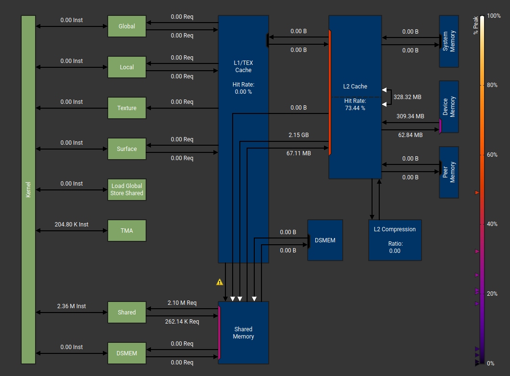

### Thread Block Cluster

将 ClusterShape 改为 `<1, 2, 1>`，让 2 个 SM 沿 reduction 维度协作，共享 shared memory：

```diff
- using ClusterShape = Shape<_1, _1, _1>;  // 不使用 TBC
+ using ClusterShape = Shape<_1, _2, _1>;  // Thread block cluster
```

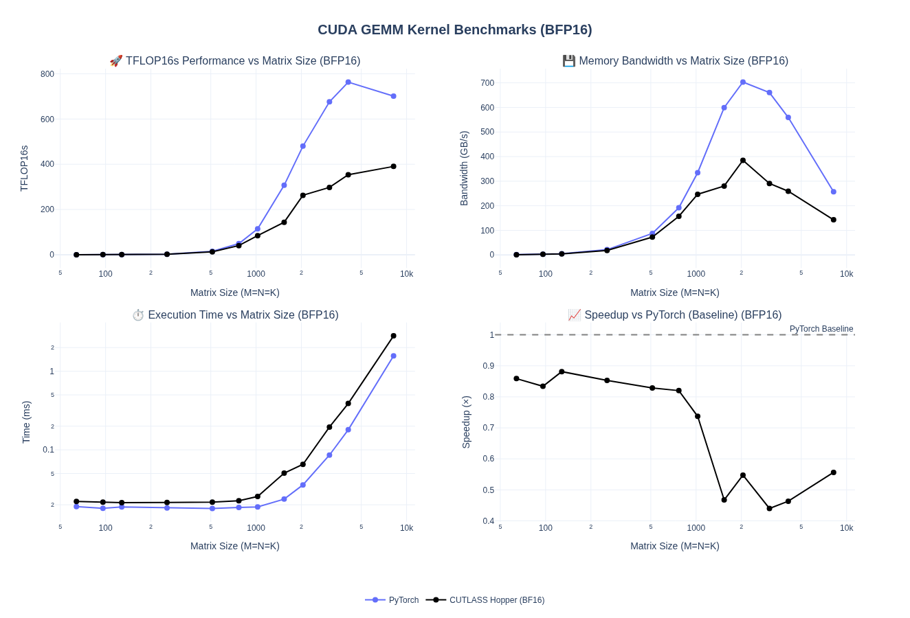

启用 TBC 带来约 5% 的性能提升。仍在 PyTorch 性能的 45-55% 范围内（batch size > 1024）。

## Persistent Cooperative Kernel

Persistent Cooperative kernel 在基础 warp specialization 上扩展了以下特性：

- **Persistent Thread Block**：启动固定数量的 thread block（如 H100 的 132 个），每个处理多个 tile。摊销 kernel 启动开销，提升 SM 利用率
- **Cooperative Consumer**：两个消费者 warp group 将每个输出 tile 沿 M 维度一分为二。降低每个消费者的寄存器压力，允许更大 tile 以提升算术强度和 cache 复用
- **TileScheduler**：动态分配 tile 给 persistent thread block，考虑 cluster 几何和 SM 可用性。Thread block 原子地获取下一个 tile 直到工作队列清空

关键代码变更：

```diff
- using KernelSchedule = cutlass::gemm::KernelTmaWarpSpecialized;
- using EpilogueSchedule = cutlass::epilogue::TmaWarpSpecialized;
+ using KernelSchedule = cutlass::gemm::KernelTmaWarpSpecializedCooperative;
+ using EpilogueSchedule = cutlass::epilogue::TmaWarpSpecializedCooperative;
+ using TileSchedulerType = cutlass::gemm::PersistentScheduler;

  using GemmKernel = cutlass::gemm::kernel::GemmUniversal<
      Shape<int, int, int>,
      CollectiveMainloop,
-     CollectiveEpilogue>;
+     CollectiveEpilogue,
+     TileSchedulerType>;
```

同时需要提供硬件信息：

```cpp
cutlass::KernelHardwareInfo hw_info;
hw_info.device_id = 0;
hw_info.sm_count = cutlass::KernelHardwareInfo::query_device_multiprocessor_count(
    hw_info.device_id);
```

### 性能

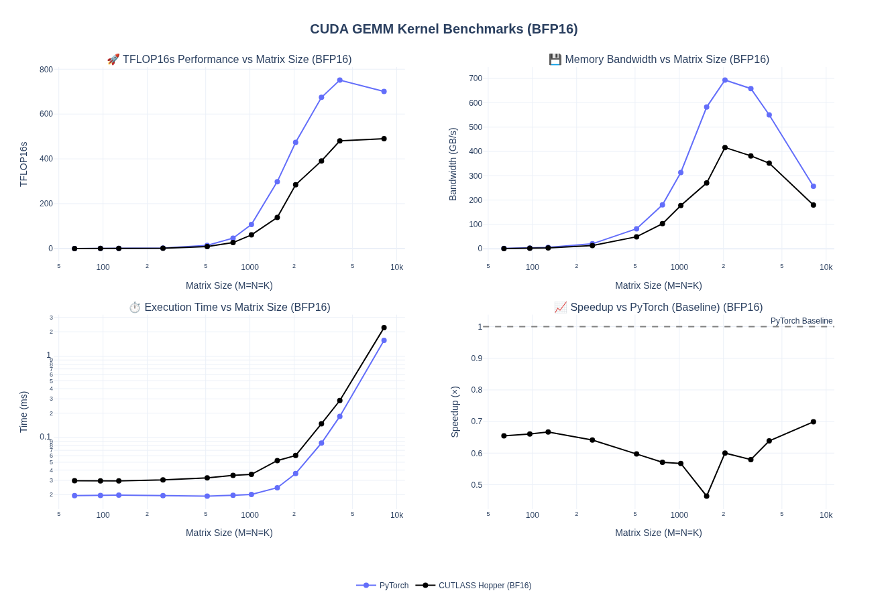

大矩阵性能显著提升，达到 PyTorch 的 **60-70%**。4096-8192 大小可达 480-490 TFLOPS（PyTorch 为 700-750 TFLOPS）。小矩阵有回退，后续 autotuning 解决。

## Ping-Pong Schedule

Ping-Pong schedule 在 Cooperative 模式基础上**将 epilogue 与 mainloop 计算重叠**。

Cooperative Schedule 的问题：两个消费者 warp group 处理同一个输出 tile，共享 A/B buffer。当两者都完成 MMA 操作后，tensor core 在 epilogue（将结果写回 global memory）期间闲置。

Ping-Pong Schedule 的解决方案：tile scheduler 给每个消费者分配**不同的输出 tile**。生产者使用有序序列屏障交替填充 buffer。消费者 1 执行 MMA 时，消费者 2 执行 epilogue，然后角色互换——最大化 tensor core 利用率。

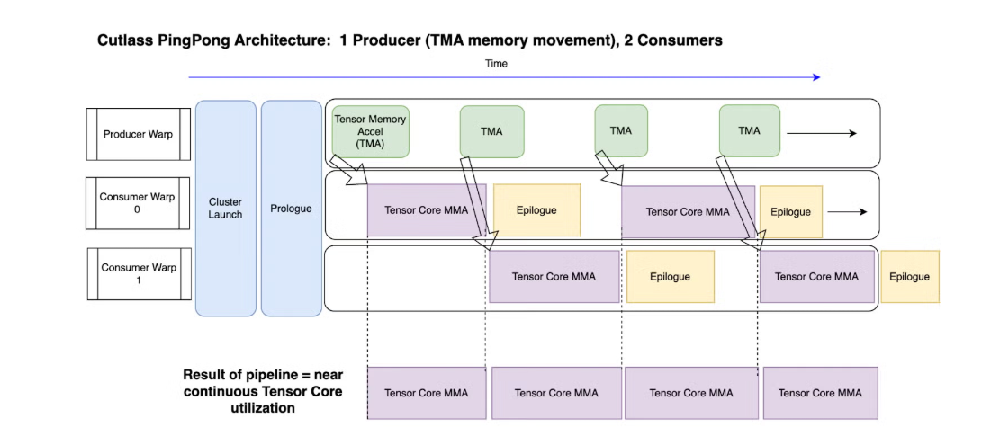

### 统一配置框架

为支持多种 kernel 组合，引入枚举和模板化配置：

```cpp
enum class HopperKernelType {
    TmaWarpSpecialized,            // 基础 TMA warp specialization
    TmaWarpSpecializedPersistent,  // TMA + persistent scheduling
    TmaWarpSpecializedPingpong,    // TMA + ping-pong cooperative
    TmaWarpSpecializedStreamK      // TMA + Stream-K scheduling
};

enum class StageCountType {
    Auto,      // 自动计算 stage 数
    Constant   // 固定 stage 数
};
```

通过 `constexpr if` 辅助函数选择不同的 schedule：

```cpp
'''
Kernel schedule 选择逻辑：
- TileM < 128: 始终用基础 TmaWarpSpecialized
- 其他根据 KernelType 枚举选择对应 schedule
- Persistent 和 StreamK 都映射到 Cooperative 底层实现
'''
template <HopperKernelType KernelType, int TileM>
constexpr auto get_kernel_schedule() {
    if constexpr (TileM < 128)
        return cutlass::gemm::KernelTmaWarpSpecialized{};
    else if constexpr (KernelType == HopperKernelType::TmaWarpSpecialized)
        return cutlass::gemm::KernelTmaWarpSpecialized{};
    else if constexpr (KernelType == HopperKernelType::TmaWarpSpecializedPingpong)
        return cutlass::gemm::KernelTmaWarpSpecializedPingpong{};
    else  // Persistent or StreamK
        return cutlass::gemm::KernelTmaWarpSpecializedCooperative{};
}

template <HopperKernelType KernelType>
constexpr auto get_tile_scheduler() {
    if constexpr (KernelType == HopperKernelType::TmaWarpSpecialized)
        return;  // void - 无 tile scheduler
    else if constexpr (KernelType == HopperKernelType::TmaWarpSpecializedStreamK)
        return cutlass::gemm::StreamKScheduler{};
    else
        return cutlass::gemm::PersistentScheduler{};
}
```

统一的 GEMM 配置模板：

```cpp
template <typename ElementType, HopperKernelType KernelType,
          StageCountType StageType, int NumStages = -1>
struct CutlassHopperGemmConfig {
    using ElementA = ElementType;
    using ElementAccumulator = float;

    static constexpr int TileM = 128;
    static constexpr int TileN = (StageType == StageCountType::Constant
                                  && NumStages >= 1 && NumStages <= 3) ? 256 : 128;
    static constexpr int TileK = 64;

    using TileShape = Shape<cute::Int<TileM>, cute::Int<TileN>, cute::Int<TileK>>;
    using ClusterShape = Shape<_2, _1, _1>;

    using KernelSchedule = decltype(get_kernel_schedule<KernelType, TileM>());
    using EpilogueSchedule = decltype(get_epilogue_schedule<KernelType>());
    using TileSchedulerType = decltype(get_tile_scheduler<KernelType>());
    using StageCount = decltype(get_stage_count<StageType, ElementA, NumStages>());

    using CollectiveMainloop = typename cutlass::gemm::collective::CollectiveBuilder<
        cutlass::arch::Sm90, cutlass::arch::OpClassTensorOp,
        ElementA, LayoutA, AlignmentA,
        ElementB, LayoutB, AlignmentB,
        ElementAccumulator, TileShape, ClusterShape,
        StageCount, KernelSchedule>::CollectiveOp;

    // ... CollectiveEpilogue 类似构建 ...

    using GemmKernel = decltype(make_gemm_kernel_type<TileSchedulerType>());
    using Gemm = cutlass::gemm::device::GemmUniversalAdapter<GemmKernel>;
};
```

### Ping-Pong 性能

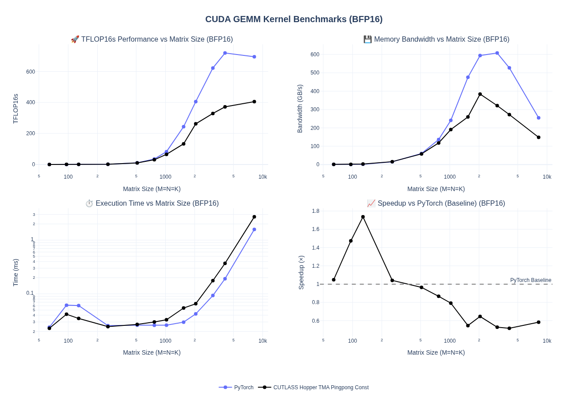

Ping-Pong 在未做 swizzling 和详细 autotuning 的情况下，8192 大小勉强达到 400 TFLOPS。需要结合 swizzling 和更精细的调优。

## Stream-K Scheduling

### Wave Quantization 问题

标准 GEMM kernel 将输出 tile 以离散 wave 分配给 SM。当工作单元数不能被 SM 数整除时，最后一个不完整的 wave 导致 SM 闲置——即 **wave quantization**。

例如，H100 SXM5 有 132 个 SM，计算 133 个 tile 需要 2 个完整 wave——与计算 264 个 tile 的开销相同。第 133 个 tile 实际上使设备利用率减半。

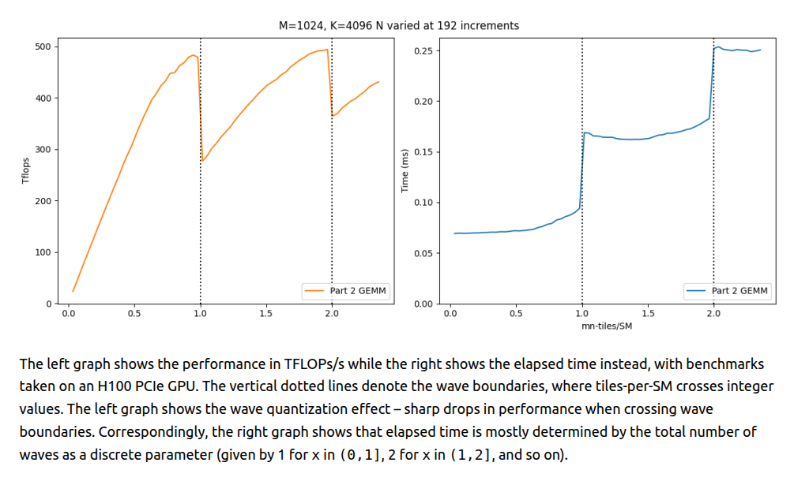

*来源: [CUTLASS Tutorial: Persistent Kernels and Stream-K](https://research.colfax-intl.com/cutlass-tutorial-persistent-kernels-and-stream-k/)*

### Data-Parallel 方法

最直接的解决方案是减小 tile 大小以创建更多工作单元来填充不完整的 wave。但更小的 tile 降低算术强度（参考之前的 tiling 章节），减少 warp scheduler 的延迟隐藏机会。性能损失往往抵消了改善的 wave 平衡。

### Split-K 分区

沿 K 维度将 tile 分成固定数量的片段（如将 128×128×128 拆为两个 128×128×64）。与拆分 M 或 N 不同，这增加工作单元而不缩小输出 tile 尺寸，能更好地保持算术强度。

协作同一 tile 的 CTA 通过 global memory workspace 执行 turnstile reduction：每个等待处理更早 K-slice 的 CTA 到达屏障，将部分结果 reduce 到 workspace，然后通知完成。最终 CTA 从 workspace reduce 到累加器并执行 epilogue。

更多 split 改善 wave 平衡但降低 K-tile 效率（更低算术强度、更少延迟隐藏机会）并增加同步开销。

### Stream-K：分数 Tile 分配

Stream-K 通过给每个 persistent CTA 分配**分数数量**的工作 tile 来完全消除 wave quantization。在 9 tile、4 SM 的例子中，每个 SM 精确计算 2.25 个 tile 而非离散 wave。

SM0 处理 tile 0、1 和 tile 2 的 ¼；SM1 完成 tile 2、处理 tile 3、开始 tile 4 的一半。分割的 tile 沿 K 维度使用 turnstile reduction（类似 Split-K），但有时间调度——早期 K-piece 远早于最终 piece 完成，最小化屏障等待时间。

总时间接近 2.25 个工作单元（naive 方法需要 3 个 wave），仅有极小的同步开销。

### Hybrid Stream-K

Stream-K 消除了 wave quantization 但引入了时间偏移，损害 L2 cache 性能。Hybrid Stream-K 将工作分为两个阶段：
1. **Stream-K 阶段**：处理恰好 1 个完整 wave + 部分 wave，使用分数 tile
2. **Data-parallel 阶段**：标准调度执行剩余完整 tile（能被 SM 数整除），恢复相邻 tile 的 cache 局部性

### Stream-K 性能

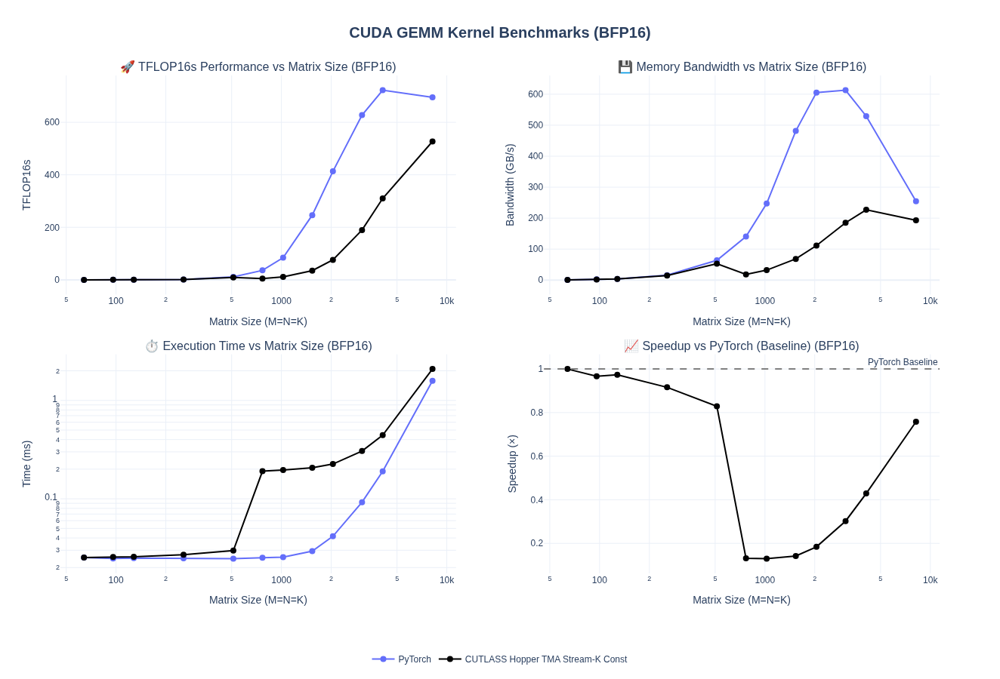

突破 500+ TFLOPS。需要将 stage count 降到 3 才能在 8192 大小上获得最佳性能。部分小 batch size 性能有退步，后续 autotune 解决。

## CTA Rasterization 和 Swizzle

### CTA Rasterization

[CTA rasterization](https://docs.nvidia.com/cutlass/latest/media/docs/cpp/efficient_gemm.html#threadblock-rasterization) 定义 thread block 映射到 GEMM tile 并在 GPU 上执行的顺序。目标是让逻辑上相邻的工作 tile 在物理硬件上也相近。朴素的行主序启动通常导致 L2 复用差和冗余 global load。

### Swizzling

在 rasterization 基础上，swizzling 进一步重映射扫描顺序，最小化 bank conflict。以 32-byte swizzling 在 8×8 grid 上为例：

```cpp
// XOR 行索引与列位来打乱 bank 分配：
swizzled_address = (row * stride) + (col ^ ((row & 7) << 2))
```

同一列的数据分散到不同 bank，消除冲突。

**64-byte swizzling**：

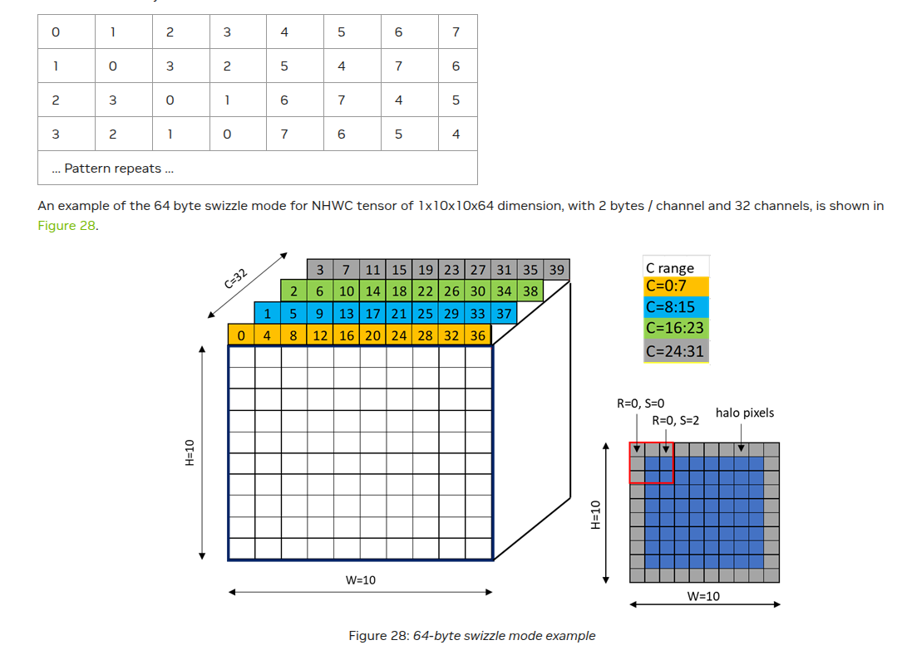

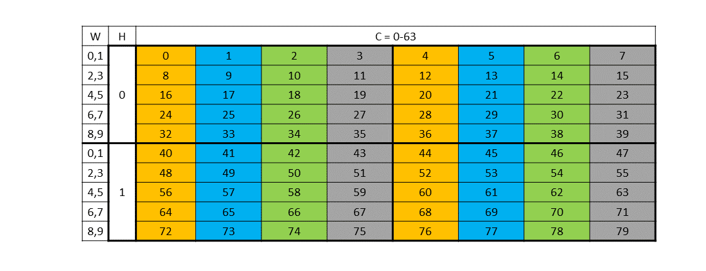

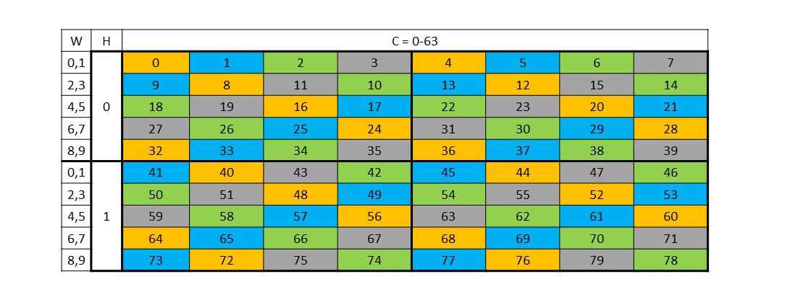

**128-byte swizzling**：

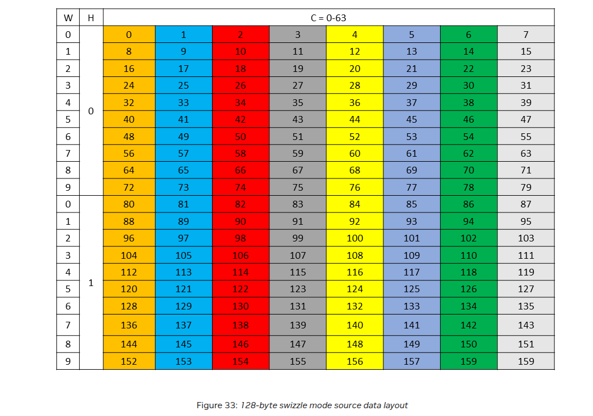

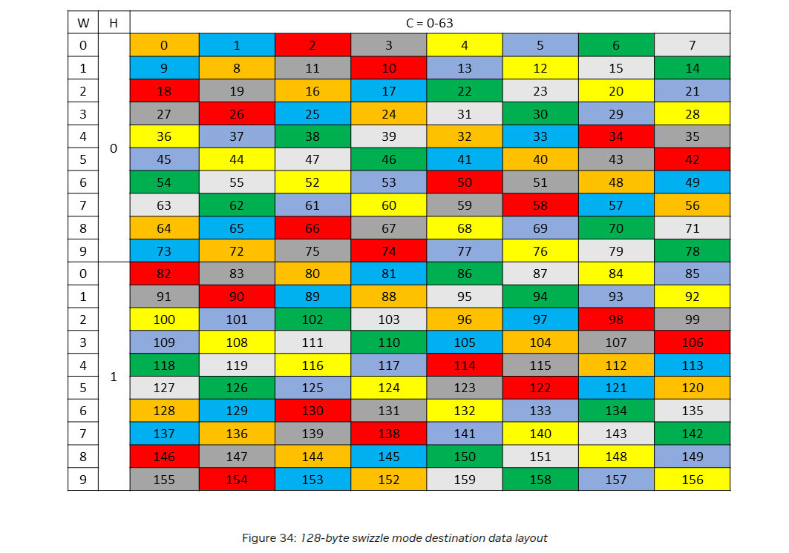

## 最终 Autotuning

将所有配置选项整合后，运行了 **1300+** 种不同的 kernel 组合。

所有 kernel 使用 **TMA Persistent Cooperative**（无 Ping-Pong）。Cluster 大小均为 1×1×1。

| 矩阵大小 | 最佳 TFLOPS | 相对 PyTorch | 最佳配置 | 范围 |
|-----------|-------------|-------------|----------|------|
| 128³ | 0.40 | **157.5%** | 128×128×64, Heuristic, Swizzle=1 | 0.14 - 0.40 |
| 256³ | 2.98 | **147.9%** | 128×128×64, Heuristic, Swizzle=1 | 0.92 - 2.98 |
| 512³ | 20.51 | **127.9%** | 128×128×64, Along N, Swizzle=2, DataParallel | 7.12 - 20.51 |
| 1024³ | 126.14 | 98.8% | 128×128×64, Heuristic, Swizzle=2, DataParallel | 11.76 - 126.14 |
| 2048³ | 497.56 | 100.9% | 128×256×64, Along M, Swizzle=4 | 71.32 - 497.56 |
| 4096³ | 654.97 | 88.1% | 128×256×64, Along N, Swizzle=8, SplitK | 208.44 - 654.97 |
| 6144³ | 672.66 | 96.5% | 128×256×64, Along N, Swizzle=1, SplitK | 280.22 - 672.66 |
| 8192³ | 599.33 | **90.2%** | 128×256×64, Heuristic, Swizzle=8 | 312.44 - 599.33 |

### 配置分析

**Raster + Swizzle**：小矩阵（128³-512³）从 swizzling 中获益不多；大矩阵（4096³-8192³）受益于激进的 swizzling 配合方向性 rasterization（Along M/N），最大化 L2 cache 复用并最小化 bank conflict。

**Splitting 策略**：DataParallel 在小到中等大小（128³-1024³）占优（wave quantization 较小）；SplitK/StreamK 在大矩阵（4096³-6144³）上开始表现更好。Heuristic 模式在所有大小上都具有竞争力。

### 关键结论

- 大矩阵（4096-8192）：达到 PyTorch 的 **~90%**
- 小矩阵（128-512）：**超越** PyTorch（最高 157.5%），因为 CUTLASS kernel 可以针对小规模优化寄存器使用
- 最佳配置高度依赖矩阵大小，autotuning 不可替代

## 后记

本文涵盖了 Hopper 架构的核心特性及其在 GEMM 优化中的应用。后续探索方向包括 FP8/FP4 kernel 在 Hopper/Blackwell 上的实现。

## 参考资料

- [Outperforming cuBLAS on H100: a Worklog](https://cudaforfun.substack.com/p/outperforming-cublas-on-h100-a-worklog)
- [CUTLASS 3.x: Orthogonal, Reusable, and Composable Abstractions for GEMM Kernel Design](https://developer.nvidia.com/blog/cutlass-3-x-orthogonal-reusable-and-composable-abstractions-for-gemm-kernel-design/)
- [Developing Optimal CUDA Kernels on Hopper Tensor Cores](https://www.nvidia.com/en-us/on-demand/session/gtcspring23-s51413/)
- [CUDA Techniques to Maximize Compute and Instruction Throughput](https://www.nvidia.com/en-us/on-demand/session/gtc25-s72685/)
- [NVIDIA Hopper Architecture In-Depth](https://developer.nvidia.com/blog/nvidia-hopper-architecture-in-depth/)
- [CUTLASS Tutorial: Persistent Kernels and Stream-K](https://research.colfax-intl.com/cutlass-tutorial-persistent-kernels-and-stream-k/)
- [Efficient GEMM in CUDA](https://docs.nvidia.com/cutlass/media/docs/cpp/efficient_gemm.html)
- [CUDA C++ Programming Guide: Warp Specialization](https://docs.nvidia.com/cuda/cuda-c-programming-guide/#spatial-partitioning-also-known-as-warp-specialization)
- [Deep Dive on CUTLASS Ping-Pong GEMM Kernel](https://pytorch.org/blog/cutlass-ping-pong-gemm-kernel/)
- [Stream-K Paper](https://arxiv.org/pdf/2301.03598)
- [NVIDIA Deep Learning Performance Guide](https://docs.nvidia.com/deeplearning/performance/dl-performance-matrix-multiplication/index.html#wave-quant)
- [bertmaher/simplegemm](https://github.com/bertmaher/simplegemm)
